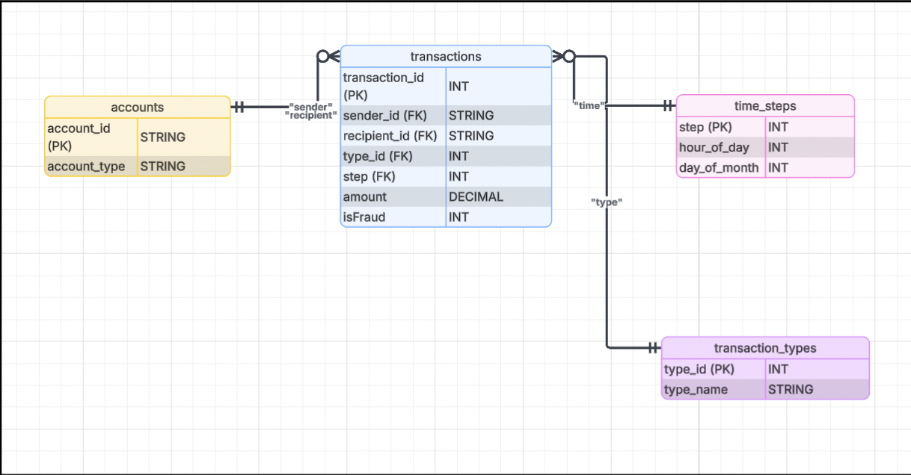

# DS4320-project1-mobile-fraud-detection

## Problem Definition

**Initial General Problem**:

As digital payments are becoming increasingly more common, cases of financial fraud are growing rapidly, impacting the integrity and safety of financial institutions and consumers, while costing both groups billions of dollars.

**Refined Specific Problem**:

Can we predict whether a mobile payment is fraudulent based on transaction type, amount, whether the recipient is the merchant or customer, the hour of the day, and the day of the month?

The general problem of financial fraud was refined to focus on predicting fraudulent activity in mobile payments using the PaySim synthetic dataset. This dataset simulates one month of mobile transactions, describing transaction types, amounts, recipient type, the time of day, and the day of the month. We use synthetic data for this refined problem, as real-world financial fraud datasets are either anonymized or not publicly available, and are therefore, difficult to interpret and make predictions. We exclude variables describing the before and after transaction monetary balance for each customer to prevent data leakage, as the simulation process causes balance variables to reflect the outcome of fraudulent transactions instead of treating them as independent predictors.

The motivation behind this project is to detect fraudulent mobile money transactions so that we can identify suspicious transactions and prevent financial losses from occurring. Tens of thousands of fraudulent mobile transactions occur per day, costing customers and institutions millions, or even billions of dollars a year. By identifying trends in these mobile transactions, such as common fraudulent transaction types or unusually large amounts, institutions can warn customers about potential scams. Institutions can also implement preventive measures such as identity and transaction verification systems to reduce the likelihood of fraudulent activity.

[Machine Learning Model Detects Fraudulent Mobile Transactions](press_release.md)

## Domain Exposition

| Term | Definition |
|------|------------|
| Mobile Money (Contextual) | A financial service that allows users to store, send, and receive money using a mobile phone |
| PaySim (Contextual) | A mobile money transaction simulator that generates synthetic financial data based on real transaction logs |
| isFraud (Original Feature) | Binary label indicating whether a transaction is fraudulent (1) or legitimate (0) |
| type (Original Feature) | The category of a transaction: CASH-IN, CASH-OUT, DEBIT, PAYMENT, or TRANSFER |
| amount (Original Feature) | The monetary value of the transaction in local currency |
| step (Original Feature) | A unit of simulated time where each step represents one hour; the dataset spans 743 steps (31 days) |
| nameOrig (Original Feature) | The unique identifier of the customer initiating the transaction |
| nameDest (Original Feature) | The unique identifier of the recipient of the transaction |
| is_merchant (Feature Engineered) | A binary flag indicating whether the recipient is a merchant (nameDest starts with M) or a customer (nameDest starts with C) |
| hour_of_day (Feature Engineered) | The hour within a 24-hour cycle, derived by computing step modulo 24 |
| day_of_month (Feature Engineered) | The day within the 31-day simulation period, derived by computing step divided by 24 |
| Class Imbalance (Contextual) | A condition where one class is significantly underrepresented relative to the other|
| Precision (KPI) | The proportion of predicted fraudulent transactions that are actually fraudulent |
| Recall (KPI) | The proportion of actual fraudulent transactions that the model correctly identifies |
| F1 Score (KPI) | The harmonic mean of precision and recall, used as the primary evaluation metric due to class imbalance |
| Binary Classification (Contextual) | A machine learning task where each transaction is classified into one of two categories: fraudulent or legitimate |
| Data Leakage (Contextual) | The unintentional inclusion of information in model training that would not be available at prediction time, such as balance variables in this dataset |

This project lives at the intersection between the domains of financial technology, mobile payment systems, and machine learning. Mobile payment systems, such as Venmo and Zelle, are platforms where people can send money to others directly through their phones. Financial technology companies that run these platforms implement systems to track millions of these mobile transactions every day, which would be impossible to do manually. Machine learning solves this problem by identifying patterns in fraudulent activity so that these companies can mitigate fraud and take as many preventative actions as possible.

| Title | Description | Link |
|-------|-------------|------|
| PaySim: A Financial Mobile Money Simulator for Fraud Detection | Presents the PaySim simulator, describing how it generates synthetic mobile money transaction data based on real financial logs and injects fraudulent behavior for fraud detection research | https://github.com/stefanregalia/DS4320-project1-mobile-fraud-detection/blob/main/background_reading/PaySim.pdf |
| Fraud Prevention: An Overview | Provides a broad overview of fraud prevention strategies, explaining the types of financial fraud and how institutions detect and respond to them | https://github.com/stefanregalia/DS4320-project1-mobile-fraud-detection/blob/main/background_reading/Fraud%20prevention_%20An%20overview.pdf |
| Fintech Fraud Detection: Techniques, Tools & Solutions | Discusses fraud detection methods used in financial technology, covering common fraud types in mobile payment systems and the tools companies use to combat them | https://github.com/stefanregalia/DS4320-project1-mobile-fraud-detection/blob/main/background_reading/Comprehensive%20Guide%20to%20Fintech%20Fraud%20Detection%20(2025).pdf |
| Balancing the Scales: A Comprehensive Study on Tackling Class Imbalance in Binary Classification | Evaluates strategies for handling class imbalance in binary classification tasks, comparing SMOTE, class weights, and decision threshold calibration across multiple models and datasets | https://github.com/stefanregalia/DS4320-project1-mobile-fraud-detection/blob/main/background_reading/Class_imbalance.pdf |
| Fraud Detection in Mobile Payment Systems using an XGBoost-based Framework | Proposes an XGBoost-based framework for detecting fraud in mobile payment systems | https://github.com/stefanregalia/DS4320-project1-mobile-fraud-detection/blob/main/background_reading/Fraud%20Detection%20in%20Mobile%20Payment%20Systems%20using%20an%20XGBoost-based%20Framework%20-%20PMC.pdf |

## Data Creation

The raw data used in this project is the PaySim Synthetic Dataset, titled "Synthetic Financial Datasets For Fraud Detection" at the Kaggle URL: https://www.kaggle.com/datasets/ealaxi/paysim1. This dataset contains 1/4 of the original PaySim Synthetic Dataset, analyzing real financial logs from one month of mobile transactions in an African country and synthetically simulating similar transactions to support fraud detection research. PaySim was created by Dr. Edgar Lopez-Rojas, Ahmad Elmir, and Stefan Axelsson in September 2016, with this portion of the dataset being uploaded to Kaggle by Edgar Lopez-Rojas at the same time.

To acquire this data, I visited the Kaggle URL listed above, clicking the "Download" button, and downloading the data as a zip folder. Inside the zip folder, I found the CSV file. Before splitting, balance-related columns were dropped to prevent data leakage, and three features were engineered: is_merchant (derived from the recipient ID prefix), hour_of_day (derived from step modulo 24), and day_of_month (derived from step divided by 24). The transformed data was then split into a relational database consisting of 4 tables: transactions, accounts, transaction_types, and time_steps.

| File Name | Description | Link |
|----------|------------|------|
| create_tables.py | Loads raw PaySim data, removes data leakage-prone columns, engineers features, and constructs relational tables (transactions, accounts, transaction_types, time_steps) and saves them as CSV and parquet files| [create_tables.py](https://github.com/stefanregalia/DS4320-project1-mobile-fraud-detection/blob/main/code/create_tables.py) |

The first source of bias that could have been introduced in the data collection process is the use of synthetic data. This means that the data is not real and it was simulated based on real mobile transaction data instead. This can introduce bias if it does not truly capture the same complexity and patterns as the real data. Another form of bias in the data collection process is selection bias, as the synthetic data was simulated based on financial transactions from only one African country, so we do not know the causes and effects of mobile fraud in other geographic regions. Lastly, as stated in the Kaggle dataset description: The fraudulent behavior of the agents aims to profit by taking control or customers accounts and try to empty the funds by transferring to another account and then cashing out of the system. This does not accurately reflect other potential fraudulent tactics, such as identity spoofing, in mobile payment transactions.

While bias related to the use of synthetic data can not be completely eliminated, we can mitigate bias by evaluating model performance across multiple subsets of the data using bootstrapping and cross-validation methods. To mitigate geographic bias and limited fraudulent behavior bias, we must ensure that we do not overgeneralize findings to regions outside of this specific African country and to other methods of fraud. We can also evaluate feature importance to ensure that model performance is not driven specifically by one transaction type.

The first critical decision that was made during the data creation process was the dropping of the balance columns (oldbalanceOrg, newbalanceOrig, oldbalanceDest, newbalanceDest). These columns were dropped to prevent data leakage, as the simulation process causes balance variables to reflect the outcome of fraudulent transactions instead of treating them as independent predictors. The next critical decision regarded splitting the data into 4 relational tables: transactions, accounts, transaction_types, and time_steps. This helped to normalize the data and reduce redundancy. This decision was made to align with the relational model and to make the data more efficient to query using SQL. Account types were stored as strings to preserve the original PaySim format, which encodes entity type in the ID prefix (C = customer, M = merchant). Lastly, three features were engineered from the raw data: is_merchant (derived from the recipient ID prefix), hour_of_day (derived from step modulo 24), and day_of_month (derived from step divided by 24). These features were chosen because they are available at prediction time and do not introduce leakage, while still providing meaningful signal for fraud detection.

The use of synthetic data introduces uncertainty regarding how well the model will generalize to real-world transactions, as the simulation may not capture all real fraud patterns. Additionally, the `on_bad_lines='skip'` parameter used when loading the raw CSV skips malformed rows, introducing a small amount of uncertainty regarding whether any skipped rows contained fraudulent transactions. This uncertainty is mitigated by the fact that only a small number of rows were affected. Finally, the engineered features `hour_of_day` and `day_of_month` are derived from a simulated time step rather than real timestamps, which introduces uncertainty about whether time-based patterns in the simulation reflect real-world transaction timing behavior.

## Metadata

| Table | Description | Link |
|-------|-------------|------|
| transactions | Core fact table containing all transaction records including sender, recipient, transaction type, amount, time step, and fraud label | [transactions.csv](https://myuva-my.sharepoint.com/:x:/g/personal/xtm9px_virginia_edu/IQAeuD-eNpRqSpw5K42VMXfCAS8Jtb-Qu2AzsZFgAbkdGCc?e=5arzuQ) |
| accounts | Dimension table containing unique account IDs and their type (customer or merchant) | [accounts.csv](https://myuva-my.sharepoint.com/:x:/g/personal/xtm9px_virginia_edu/IQCC-GDckonESJ7yAjBtv7clAWURbm0VDtUtrfy3T9906fg?e=fyFXql) |
| transaction_types | Lookup table mapping transaction type IDs to their names | [transaction_types.csv](https://myuva-my.sharepoint.com/:x:/g/personal/xtm9px_virginia_edu/IQCzlkqJ26QoRbcpZabk3FiIAfbNZd-_sYzBCiqicH_cGVE?e=64tTFe) |
| time_steps | Dimension table mapping each simulation hour to its hour of day and day of month | [time_steps.csv](https://myuva-my.sharepoint.com/:x:/g/personal/xtm9px_virginia_edu/IQAl0lzioXyRSaT1drg4fR5wAYvxHZtHfbYtJZiuKNIewKI?e=VcoMuX) |

All relational data can be found here: https://myuva-my.sharepoint.com/:f:/g/personal/xtm9px_virginia_edu/IgCoK6DBYXegSqoNcsr_CHx4ARM2WIf5gcOg3Dr6DDuTZOY?e=WL7sF8

| Name | Data Type | Description | Example |
|------|-----------|-------------|---------|
| transaction_id (transactions) | INT | Unique identifier for each transaction, auto-generated | 1 |
| sender_id (transactions) | STRING | Unique identifier of the account sending the transaction | C1231006815 |
| recipient_id (transactions) | STRING | Unique identifier of the account receiving the transaction | M1979787155 |
| type_id (transactions) | INT | Foreign key referencing the transaction_types table | 1 |
| step (transactions) | INT | Foreign key referencing the time_steps table; simulation hour of the transaction | 1 |
| amount (transactions) | DECIMAL | Monetary value of the transaction in local currency | 9839.64 |
| isFraud (transactions) | INT | Binary label indicating whether the transaction is fraudulent (1 = True, 0 = False) | 0 |
| account_id (accounts) | STRING | Unique identifier of an account, encoded as C (customer) or M (merchant) prefix | C1231006815 |
| account_type (accounts) | STRING | Type of account derived from account_id prefix | customer |
| type_id (transaction_types) | INT | Unique identifier for each transaction type | 1 |
| type_name (transaction_types) | STRING | Name of the transaction type | PAYMENT |
| step (time_steps) | INT | Simulation hour (1-743) representing one hour of real time | 1 |
| hour_of_day (time_steps) | INT | Hour within a 24-hour cycle, derived from step modulo 24 | 1 |
| day_of_month (time_steps) | INT | Day within the 31-day simulation, derived by integer division of step by 24 (0–30 range due to zero-based indexing) | 1 |

| Feature | Table | Mean | Std Dev | Min | Max | Missing | Interpretation |
|---------|-------|------|---------|-----|-----|---------|----------------|
| amount (transactions) | transactions | 179,861.90 | 603,858.23 | 0.00 | 92,445,516.64 | 0 | Highly skewed distribution with a large standard deviation, indicating most transactions are small but a few are extremely large |
| step (transactions) | transactions | 243.40 | 142.33 | 1.00 | 743.00 | 0 | Transactions are spread relatively evenly across the 743-hour simulation period |
| hour_of_day (time_steps) | time_steps | 11.52 | 6.92 | 0.00 | 23.00 | 0 | Transactions occur at all hours of the day with a roughly uniform distribution |
| day_of_month (time_steps) | time_steps | 15.02 | 8.94 | 0.00 | 30.00 | 0 | Transactions are spread evenly across the 31-day simulation period |
