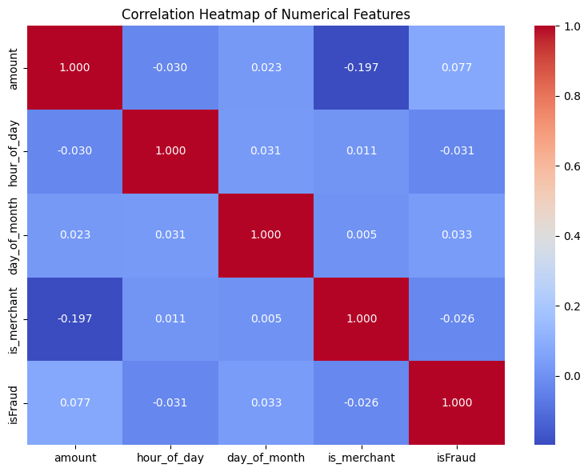
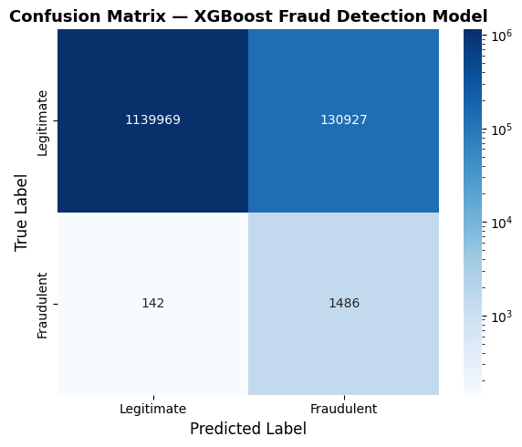

# Pipeline

### Data Loading and EDA


```python
# Loads relational tables into DuckDB, prepares data with SQL, and runs EDA

import duckdb
import pandas as pd
import seaborn as sns
import matplotlib.pyplot as plt
import logging

# Configuring logging
logging.basicConfig(
    filename='../../.logs/pipeline.log',
    level=logging.INFO,
    format='%(asctime)s - %(levelname)s - %(message)s'
)

# Loading relational tables into DuckDB
con = duckdb.connect()
try: 
    con.execute("CREATE TABLE transactions AS SELECT * FROM read_csv_auto('../../data/relational/transactions.csv')")
    con.execute("CREATE TABLE transaction_types AS SELECT * FROM read_csv_auto('../../data/relational/transaction_types.csv')")
    con.execute("CREATE TABLE time_steps AS SELECT * FROM read_csv_auto('../../data/relational/time_steps.csv')")
    con.execute("CREATE TABLE accounts AS SELECT * FROM read_csv_auto('../../data/relational/accounts.csv')")
    logging.info("Tables created successfully.")
except Exception as e:
    logging.error(f"Error creating tables: {e}")


# SQL query to prepare data for modeling
try:
    df = con.execute("""
        SELECT
          t.amount,
          t.isFraud,
          tt.type_name,
          ts.hour_of_day,
          ts.day_of_month,
          COALESCE(CASE WHEN a.account_type = 'merchant' THEN 1 ELSE 0 END, 0) AS is_merchant
        FROM transactions t
        JOIN transaction_types tt ON t.type_id = tt.type_id
        JOIN time_steps ts ON t.step = ts.step
        LEFT JOIN accounts a ON t.recipient_id = a.account_id
    """).df()
    logging.info(f"Query successful. DataFrame shape: {df.shape}")
except Exception as e:
    logging.error(f"Error executing SQL query: {e}")
    raise

# Performing brief EDA

print(df.shape)
print(df.isnull().sum())
print(df['isFraud'].value_counts())
```

    (6362620, 6)
    amount          0
    isFraud         0
    type_name       0
    hour_of_day     0
    day_of_month    0
    is_merchant     0
    dtype: int64
    isFraud
    0    6354407
    1       8213
    Name: count, dtype: int64


```python
# Correlation heatmap of numerical features
corr = df[['amount', 'hour_of_day', 'day_of_month', 'is_merchant', 'isFraud']].corr()

fig, ax = plt.subplots(figsize=(8, 6))
sns.heatmap(corr, annot=True, fmt='.3f', cmap='coolwarm', ax=ax)
ax.set_title('Correlation Heatmap of Numerical Features')
plt.tight_layout()
plt.show()
```


    

    


### Analysis Rationale

As the predictive features above show little correlation with the outcome variable, I used a gradient boosting classifier to build decision trees sequentially, correcting the errors of previous trees. This model prevents overfitting with its built in regularization in its objective function, as well as in its hyperparameters, which we tune. We handled class imbalance by implementing `scale_pos_weight`, which balances the positive and negative classes. This allows for better model performance, as our current `is_fraud` target label only makes up 0.13% of observations. We used GridSearchCV to find optimal hyperparameters such as the number of estimators, the maximum depth of trees, and the learning rate. Inside the grid search, we implemented stratified K-fold cross-validation, preserving the same class percentage as the whole dataset, ensuring representative train/test sets. This allowed the model to learn patterns based on the same class imbalance proportion in the entire dataset. We used "recall" as the scoring, as minimizing false negatives is more important than minimizing false positives in fraud. This is because missing a fraudulent transaction is more costly for a business and for the customer than flagging a legitimate transaction. 

After performing the cross-validation through grid search, the training recall was approximately 0.90 with learning_rate of 0.1, maximum depth of 3, and 100 estimators. We fit this best model to the test set, resulting in a recall of approximately 0.91, meaning that we catch ~91% of fraudulent transactions. However, the model's precision was ~0.01, meaning that the false positive rate was much too high. This is most likely due to the low predictive performance of the features.


```python
from xgboost import XGBClassifier
from sklearn.pipeline import make_pipeline
from sklearn.preprocessing import StandardScaler
from sklearn.model_selection import train_test_split, GridSearchCV, StratifiedKFold
from sklearn.metrics import recall_score, f1_score, precision_score, confusion_matrix

# Preparing features

df = pd.get_dummies(df, columns = ['type_name']) # Converting categorical columns to numeric
X = df.drop(columns = ['isFraud']) # Defining predictor variables
y = df['isFraud'] # Defining target variable

# Calculating scale_pos_weight to handle class imbalance
scale_pos_weight = (y == 0).sum() / (y == 1).sum()

# Splitting the data
X_train, X_test, y_train, y_test = train_test_split(X, y, test_size = 0.2, random_state = 42)

model = make_pipeline(StandardScaler(), XGBClassifier(scale_pos_weight = scale_pos_weight, random_state = 42)) # Instantiating the model

# Hyperparameter tuning with GridSearchCV
param_grid = {
    'xgbclassifier__n_estimators': [100, 200, 300],
    'xgbclassifier__max_depth': [3, 5, 7],
    'xgbclassifier__learning_rate': [0.01, 0.1, 0.2]
}

# Using StratifiedKFold to maintain class distribution in folds and optimizing for recall
grid_search = GridSearchCV(
    estimator=model, 
    param_grid=param_grid, 
    cv=StratifiedKFold(n_splits=3), 
    scoring='recall', 
    n_jobs=1,
    verbose=3
)

grid_search.fit(X_train, y_train)

```

    Fitting 3 folds for each of 27 candidates, totalling 81 fits
    [CV 1/3] END xgbclassifier__learning_rate=0.01, xgbclassifier__max_depth=3, xgbclassifier__n_estimators=100;, score=0.908 total time=   5.3s
    [CV 2/3] END xgbclassifier__learning_rate=0.01, xgbclassifier__max_depth=3, xgbclassifier__n_estimators=100;, score=0.890 total time=   4.5s
    [CV 3/3] END xgbclassifier__learning_rate=0.01, xgbclassifier__max_depth=3, xgbclassifier__n_estimators=100;, score=0.897 total time=   4.9s
    [CV 1/3] END xgbclassifier__learning_rate=0.01, xgbclassifier__max_depth=3, xgbclassifier__n_estimators=200;, score=0.897 total time=   7.1s
    [CV 2/3] END xgbclassifier__learning_rate=0.01, xgbclassifier__max_depth=3, xgbclassifier__n_estimators=200;, score=0.890 total time=   7.0s
    [CV 3/3] END xgbclassifier__learning_rate=0.01, xgbclassifier__max_depth=3, xgbclassifier__n_estimators=200;, score=0.897 total time=   8.1s
    [CV 1/3] END xgbclassifier__learning_rate=0.01, xgbclassifier__max_depth=3, xgbclassifier__n_estimators=300;, score=0.899 total time=  11.0s
    [CV 2/3] END xgbclassifier__learning_rate=0.01, xgbclassifier__max_depth=3, xgbclassifier__n_estimators=300;, score=0.891 total time=  10.4s
    [CV 3/3] END xgbclassifier__learning_rate=0.01, xgbclassifier__max_depth=3, xgbclassifier__n_estimators=300;, score=0.895 total time=  13.7s
    [CV 1/3] END xgbclassifier__learning_rate=0.01, xgbclassifier__max_depth=5, xgbclassifier__n_estimators=100;, score=0.908 total time=   8.6s
    [CV 2/3] END xgbclassifier__learning_rate=0.01, xgbclassifier__max_depth=5, xgbclassifier__n_estimators=100;, score=0.890 total time=   7.2s
    [CV 3/3] END xgbclassifier__learning_rate=0.01, xgbclassifier__max_depth=5, xgbclassifier__n_estimators=100;, score=0.895 total time=   5.2s
    [CV 1/3] END xgbclassifier__learning_rate=0.01, xgbclassifier__max_depth=5, xgbclassifier__n_estimators=200;, score=0.900 total time=   7.6s
    [CV 2/3] END xgbclassifier__learning_rate=0.01, xgbclassifier__max_depth=5, xgbclassifier__n_estimators=200;, score=0.892 total time=   7.3s
    [CV 3/3] END xgbclassifier__learning_rate=0.01, xgbclassifier__max_depth=5, xgbclassifier__n_estimators=200;, score=0.895 total time=   7.4s
    [CV 1/3] END xgbclassifier__learning_rate=0.01, xgbclassifier__max_depth=5, xgbclassifier__n_estimators=300;, score=0.901 total time=  10.8s
    [CV 2/3] END xgbclassifier__learning_rate=0.01, xgbclassifier__max_depth=5, xgbclassifier__n_estimators=300;, score=0.895 total time=  10.3s
    [CV 3/3] END xgbclassifier__learning_rate=0.01, xgbclassifier__max_depth=5, xgbclassifier__n_estimators=300;, score=0.899 total time=  10.4s
    [CV 1/3] END xgbclassifier__learning_rate=0.01, xgbclassifier__max_depth=7, xgbclassifier__n_estimators=100;, score=0.913 total time=   5.5s
    [CV 2/3] END xgbclassifier__learning_rate=0.01, xgbclassifier__max_depth=7, xgbclassifier__n_estimators=100;, score=0.892 total time=   5.4s
    [CV 3/3] END xgbclassifier__learning_rate=0.01, xgbclassifier__max_depth=7, xgbclassifier__n_estimators=100;, score=0.885 total time=   5.5s
    [CV 1/3] END xgbclassifier__learning_rate=0.01, xgbclassifier__max_depth=7, xgbclassifier__n_estimators=200;, score=0.913 total time=   8.6s
    [CV 2/3] END xgbclassifier__learning_rate=0.01, xgbclassifier__max_depth=7, xgbclassifier__n_estimators=200;, score=0.894 total time=   8.5s
    [CV 3/3] END xgbclassifier__learning_rate=0.01, xgbclassifier__max_depth=7, xgbclassifier__n_estimators=200;, score=0.883 total time=   8.4s
    [CV 1/3] END xgbclassifier__learning_rate=0.01, xgbclassifier__max_depth=7, xgbclassifier__n_estimators=300;, score=0.908 total time=  11.7s
    [CV 2/3] END xgbclassifier__learning_rate=0.01, xgbclassifier__max_depth=7, xgbclassifier__n_estimators=300;, score=0.894 total time=  11.8s
    [CV 3/3] END xgbclassifier__learning_rate=0.01, xgbclassifier__max_depth=7, xgbclassifier__n_estimators=300;, score=0.899 total time=  12.7s
    [CV 1/3] END xgbclassifier__learning_rate=0.1, xgbclassifier__max_depth=3, xgbclassifier__n_estimators=100;, score=0.905 total time=   4.0s
    [CV 2/3] END xgbclassifier__learning_rate=0.1, xgbclassifier__max_depth=3, xgbclassifier__n_estimators=100;, score=0.904 total time=   4.9s
    [CV 3/3] END xgbclassifier__learning_rate=0.1, xgbclassifier__max_depth=3, xgbclassifier__n_estimators=100;, score=0.903 total time=   4.1s
    [CV 1/3] END xgbclassifier__learning_rate=0.1, xgbclassifier__max_depth=3, xgbclassifier__n_estimators=200;, score=0.903 total time=   6.1s
    [CV 2/3] END xgbclassifier__learning_rate=0.1, xgbclassifier__max_depth=3, xgbclassifier__n_estimators=200;, score=0.892 total time=   6.2s
    [CV 3/3] END xgbclassifier__learning_rate=0.1, xgbclassifier__max_depth=3, xgbclassifier__n_estimators=200;, score=0.904 total time=   6.1s
    [CV 1/3] END xgbclassifier__learning_rate=0.1, xgbclassifier__max_depth=3, xgbclassifier__n_estimators=300;, score=0.902 total time=   8.1s
    [CV 2/3] END xgbclassifier__learning_rate=0.1, xgbclassifier__max_depth=3, xgbclassifier__n_estimators=300;, score=0.884 total time=   8.3s
    [CV 3/3] END xgbclassifier__learning_rate=0.1, xgbclassifier__max_depth=3, xgbclassifier__n_estimators=300;, score=0.897 total time=   8.6s
    [CV 1/3] END xgbclassifier__learning_rate=0.1, xgbclassifier__max_depth=5, xgbclassifier__n_estimators=100;, score=0.899 total time=   4.7s
    [CV 2/3] END xgbclassifier__learning_rate=0.1, xgbclassifier__max_depth=5, xgbclassifier__n_estimators=100;, score=0.887 total time=   4.6s
    [CV 3/3] END xgbclassifier__learning_rate=0.1, xgbclassifier__max_depth=5, xgbclassifier__n_estimators=100;, score=0.896 total time=   5.0s
    [CV 1/3] END xgbclassifier__learning_rate=0.1, xgbclassifier__max_depth=5, xgbclassifier__n_estimators=200;, score=0.896 total time=   8.7s
    [CV 2/3] END xgbclassifier__learning_rate=0.1, xgbclassifier__max_depth=5, xgbclassifier__n_estimators=200;, score=0.872 total time=   8.9s
    [CV 3/3] END xgbclassifier__learning_rate=0.1, xgbclassifier__max_depth=5, xgbclassifier__n_estimators=200;, score=0.885 total time=   8.8s
    [CV 1/3] END xgbclassifier__learning_rate=0.1, xgbclassifier__max_depth=5, xgbclassifier__n_estimators=300;, score=0.884 total time=  12.0s
    [CV 2/3] END xgbclassifier__learning_rate=0.1, xgbclassifier__max_depth=5, xgbclassifier__n_estimators=300;, score=0.859 total time=  11.8s
    [CV 3/3] END xgbclassifier__learning_rate=0.1, xgbclassifier__max_depth=5, xgbclassifier__n_estimators=300;, score=0.874 total time=  14.5s
    [CV 1/3] END xgbclassifier__learning_rate=0.1, xgbclassifier__max_depth=7, xgbclassifier__n_estimators=100;, score=0.895 total time=   7.7s
    [CV 2/3] END xgbclassifier__learning_rate=0.1, xgbclassifier__max_depth=7, xgbclassifier__n_estimators=100;, score=0.868 total time=   6.9s
    [CV 3/3] END xgbclassifier__learning_rate=0.1, xgbclassifier__max_depth=7, xgbclassifier__n_estimators=100;, score=0.888 total time=   5.9s
    [CV 1/3] END xgbclassifier__learning_rate=0.1, xgbclassifier__max_depth=7, xgbclassifier__n_estimators=200;, score=0.858 total time=  10.5s
    [CV 2/3] END xgbclassifier__learning_rate=0.1, xgbclassifier__max_depth=7, xgbclassifier__n_estimators=200;, score=0.842 total time=  10.7s
    [CV 3/3] END xgbclassifier__learning_rate=0.1, xgbclassifier__max_depth=7, xgbclassifier__n_estimators=200;, score=0.853 total time=  10.2s
    [CV 1/3] END xgbclassifier__learning_rate=0.1, xgbclassifier__max_depth=7, xgbclassifier__n_estimators=300;, score=0.826 total time=  16.0s
    [CV 2/3] END xgbclassifier__learning_rate=0.1, xgbclassifier__max_depth=7, xgbclassifier__n_estimators=300;, score=0.818 total time=  14.8s
    [CV 3/3] END xgbclassifier__learning_rate=0.1, xgbclassifier__max_depth=7, xgbclassifier__n_estimators=300;, score=0.835 total time=  14.5s
    [CV 1/3] END xgbclassifier__learning_rate=0.2, xgbclassifier__max_depth=3, xgbclassifier__n_estimators=100;, score=0.903 total time=   4.4s
    [CV 2/3] END xgbclassifier__learning_rate=0.2, xgbclassifier__max_depth=3, xgbclassifier__n_estimators=100;, score=0.890 total time=   4.2s
    [CV 3/3] END xgbclassifier__learning_rate=0.2, xgbclassifier__max_depth=3, xgbclassifier__n_estimators=100;, score=0.905 total time=   4.2s
    [CV 1/3] END xgbclassifier__learning_rate=0.2, xgbclassifier__max_depth=3, xgbclassifier__n_estimators=200;, score=0.897 total time=   7.0s
    [CV 2/3] END xgbclassifier__learning_rate=0.2, xgbclassifier__max_depth=3, xgbclassifier__n_estimators=200;, score=0.882 total time=   6.8s
    [CV 3/3] END xgbclassifier__learning_rate=0.2, xgbclassifier__max_depth=3, xgbclassifier__n_estimators=200;, score=0.896 total time=  15.9s
    [CV 1/3] END xgbclassifier__learning_rate=0.2, xgbclassifier__max_depth=3, xgbclassifier__n_estimators=300;, score=0.893 total time=  11.1s
    [CV 2/3] END xgbclassifier__learning_rate=0.2, xgbclassifier__max_depth=3, xgbclassifier__n_estimators=300;, score=0.874 total time=  11.2s
    [CV 3/3] END xgbclassifier__learning_rate=0.2, xgbclassifier__max_depth=3, xgbclassifier__n_estimators=300;, score=0.884 total time=  17.5s
    [CV 1/3] END xgbclassifier__learning_rate=0.2, xgbclassifier__max_depth=5, xgbclassifier__n_estimators=100;, score=0.889 total time=   8.6s
    [CV 2/3] END xgbclassifier__learning_rate=0.2, xgbclassifier__max_depth=5, xgbclassifier__n_estimators=100;, score=0.869 total time=   6.1s
    [CV 3/3] END xgbclassifier__learning_rate=0.2, xgbclassifier__max_depth=5, xgbclassifier__n_estimators=100;, score=0.888 total time=   6.7s
    [CV 1/3] END xgbclassifier__learning_rate=0.2, xgbclassifier__max_depth=5, xgbclassifier__n_estimators=200;, score=0.869 total time=   8.9s
    [CV 2/3] END xgbclassifier__learning_rate=0.2, xgbclassifier__max_depth=5, xgbclassifier__n_estimators=200;, score=0.851 total time=   9.1s
    [CV 3/3] END xgbclassifier__learning_rate=0.2, xgbclassifier__max_depth=5, xgbclassifier__n_estimators=200;, score=0.861 total time=   9.3s
    [CV 1/3] END xgbclassifier__learning_rate=0.2, xgbclassifier__max_depth=5, xgbclassifier__n_estimators=300;, score=0.847 total time=  14.5s
    [CV 2/3] END xgbclassifier__learning_rate=0.2, xgbclassifier__max_depth=5, xgbclassifier__n_estimators=300;, score=0.834 total time=  14.3s
    [CV 3/3] END xgbclassifier__learning_rate=0.2, xgbclassifier__max_depth=5, xgbclassifier__n_estimators=300;, score=0.854 total time=  14.1s
    [CV 1/3] END xgbclassifier__learning_rate=0.2, xgbclassifier__max_depth=7, xgbclassifier__n_estimators=100;, score=0.851 total time=   6.7s
    [CV 2/3] END xgbclassifier__learning_rate=0.2, xgbclassifier__max_depth=7, xgbclassifier__n_estimators=100;, score=0.828 total time=   6.6s
    [CV 3/3] END xgbclassifier__learning_rate=0.2, xgbclassifier__max_depth=7, xgbclassifier__n_estimators=100;, score=0.844 total time=   8.4s
    [CV 1/3] END xgbclassifier__learning_rate=0.2, xgbclassifier__max_depth=7, xgbclassifier__n_estimators=200;, score=0.802 total time=  11.6s
    [CV 2/3] END xgbclassifier__learning_rate=0.2, xgbclassifier__max_depth=7, xgbclassifier__n_estimators=200;, score=0.798 total time=  12.5s
    [CV 3/3] END xgbclassifier__learning_rate=0.2, xgbclassifier__max_depth=7, xgbclassifier__n_estimators=200;, score=0.805 total time=  13.4s
    [CV 1/3] END xgbclassifier__learning_rate=0.2, xgbclassifier__max_depth=7, xgbclassifier__n_estimators=300;, score=0.776 total time=  18.6s
    [CV 2/3] END xgbclassifier__learning_rate=0.2, xgbclassifier__max_depth=7, xgbclassifier__n_estimators=300;, score=0.773 total time=  18.8s
    [CV 3/3] END xgbclassifier__learning_rate=0.2, xgbclassifier__max_depth=7, xgbclassifier__n_estimators=300;, score=0.774 total time=  17.6s


<style>#sk-container-id-1 {
  /* Definition of color scheme common for light and dark mode */
  --sklearn-color-text: #000;
  --sklearn-color-text-muted: #666;
  --sklearn-color-line: gray;
  /* Definition of color scheme for unfitted estimators */
  --sklearn-color-unfitted-level-0: #fff5e6;
  --sklearn-color-unfitted-level-1: #f6e4d2;
  --sklearn-color-unfitted-level-2: #ffe0b3;
  --sklearn-color-unfitted-level-3: chocolate;
  /* Definition of color scheme for fitted estimators */
  --sklearn-color-fitted-level-0: #f0f8ff;
  --sklearn-color-fitted-level-1: #d4ebff;
  --sklearn-color-fitted-level-2: #b3dbfd;
  --sklearn-color-fitted-level-3: cornflowerblue;
}

#sk-container-id-1.light {
  /* Specific color for light theme */
  --sklearn-color-text-on-default-background: black;
  --sklearn-color-background: white;
  --sklearn-color-border-box: black;
  --sklearn-color-icon: #696969;
}

#sk-container-id-1.dark {
  --sklearn-color-text-on-default-background: white;
  --sklearn-color-background: #111;
  --sklearn-color-border-box: white;
  --sklearn-color-icon: #878787;
}

#sk-container-id-1 {
  color: var(--sklearn-color-text);
}

#sk-container-id-1 pre {
  padding: 0;
}

#sk-container-id-1 input.sk-hidden--visually {
  border: 0;
  clip: rect(1px 1px 1px 1px);
  clip: rect(1px, 1px, 1px, 1px);
  height: 1px;
  margin: -1px;
  overflow: hidden;
  padding: 0;
  position: absolute;
  width: 1px;
}

#sk-container-id-1 div.sk-dashed-wrapped {
  border: 1px dashed var(--sklearn-color-line);
  margin: 0 0.4em 0.5em 0.4em;
  box-sizing: border-box;
  padding-bottom: 0.4em;
  background-color: var(--sklearn-color-background);
}

#sk-container-id-1 div.sk-container {
  /* jupyter's `normalize.less` sets `[hidden] { display: none; }`
     but bootstrap.min.css set `[hidden] { display: none !important; }`
     so we also need the `!important` here to be able to override the
     default hidden behavior on the sphinx rendered scikit-learn.org.
     See: https://github.com/scikit-learn/scikit-learn/issues/21755 */
  display: inline-block !important;
  position: relative;
}

#sk-container-id-1 div.sk-text-repr-fallback {
  display: none;
}

div.sk-parallel-item,
div.sk-serial,
div.sk-item {
  /* draw centered vertical line to link estimators */
  background-image: linear-gradient(var(--sklearn-color-text-on-default-background), var(--sklearn-color-text-on-default-background));
  background-size: 2px 100%;
  background-repeat: no-repeat;
  background-position: center center;
}

/* Parallel-specific style estimator block */

#sk-container-id-1 div.sk-parallel-item::after {
  content: "";
  width: 100%;
  border-bottom: 2px solid var(--sklearn-color-text-on-default-background);
  flex-grow: 1;
}

#sk-container-id-1 div.sk-parallel {
  display: flex;
  align-items: stretch;
  justify-content: center;
  background-color: var(--sklearn-color-background);
  position: relative;
}

#sk-container-id-1 div.sk-parallel-item {
  display: flex;
  flex-direction: column;
}

#sk-container-id-1 div.sk-parallel-item:first-child::after {
  align-self: flex-end;
  width: 50%;
}

#sk-container-id-1 div.sk-parallel-item:last-child::after {
  align-self: flex-start;
  width: 50%;
}

#sk-container-id-1 div.sk-parallel-item:only-child::after {
  width: 0;
}

/* Serial-specific style estimator block */

#sk-container-id-1 div.sk-serial {
  display: flex;
  flex-direction: column;
  align-items: center;
  background-color: var(--sklearn-color-background);
  padding-right: 1em;
  padding-left: 1em;
}


/* Toggleable style: style used for estimator/Pipeline/ColumnTransformer box that is
clickable and can be expanded/collapsed.
- Pipeline and ColumnTransformer use this feature and define the default style
- Estimators will overwrite some part of the style using the `sk-estimator` class
*/

/* Pipeline and ColumnTransformer style (default) */

#sk-container-id-1 div.sk-toggleable {
  /* Default theme specific background. It is overwritten whether we have a
  specific estimator or a Pipeline/ColumnTransformer */
  background-color: var(--sklearn-color-background);
}

/* Toggleable label */
#sk-container-id-1 label.sk-toggleable__label {
  cursor: pointer;
  display: flex;
  width: 100%;
  margin-bottom: 0;
  padding: 0.5em;
  box-sizing: border-box;
  text-align: center;
  align-items: center;
  justify-content: center;
  gap: 0.5em;
}

#sk-container-id-1 label.sk-toggleable__label .caption {
  font-size: 0.6rem;
  font-weight: lighter;
  color: var(--sklearn-color-text-muted);
}

#sk-container-id-1 label.sk-toggleable__label-arrow:before {
  /* Arrow on the left of the label */
  content: "▸";
  float: left;
  margin-right: 0.25em;
  color: var(--sklearn-color-icon);
}

#sk-container-id-1 label.sk-toggleable__label-arrow:hover:before {
  color: var(--sklearn-color-text);
}

/* Toggleable content - dropdown */

#sk-container-id-1 div.sk-toggleable__content {
  display: none;
  text-align: left;
  /* unfitted */
  background-color: var(--sklearn-color-unfitted-level-0);
}

#sk-container-id-1 div.sk-toggleable__content.fitted {
  /* fitted */
  background-color: var(--sklearn-color-fitted-level-0);
}

#sk-container-id-1 div.sk-toggleable__content pre {
  margin: 0.2em;
  border-radius: 0.25em;
  color: var(--sklearn-color-text);
  /* unfitted */
  background-color: var(--sklearn-color-unfitted-level-0);
}

#sk-container-id-1 div.sk-toggleable__content.fitted pre {
  /* unfitted */
  background-color: var(--sklearn-color-fitted-level-0);
}

#sk-container-id-1 input.sk-toggleable__control:checked~div.sk-toggleable__content {
  /* Expand drop-down */
  display: block;
  width: 100%;
  overflow: visible;
}

#sk-container-id-1 input.sk-toggleable__control:checked~label.sk-toggleable__label-arrow:before {
  content: "▾";
}

/* Pipeline/ColumnTransformer-specific style */

#sk-container-id-1 div.sk-label input.sk-toggleable__control:checked~label.sk-toggleable__label {
  color: var(--sklearn-color-text);
  background-color: var(--sklearn-color-unfitted-level-2);
}

#sk-container-id-1 div.sk-label.fitted input.sk-toggleable__control:checked~label.sk-toggleable__label {
  background-color: var(--sklearn-color-fitted-level-2);
}

/* Estimator-specific style */

/* Colorize estimator box */
#sk-container-id-1 div.sk-estimator input.sk-toggleable__control:checked~label.sk-toggleable__label {
  /* unfitted */
  background-color: var(--sklearn-color-unfitted-level-2);
}

#sk-container-id-1 div.sk-estimator.fitted input.sk-toggleable__control:checked~label.sk-toggleable__label {
  /* fitted */
  background-color: var(--sklearn-color-fitted-level-2);
}

#sk-container-id-1 div.sk-label label.sk-toggleable__label,
#sk-container-id-1 div.sk-label label {
  /* The background is the default theme color */
  color: var(--sklearn-color-text-on-default-background);
}

/* On hover, darken the color of the background */
#sk-container-id-1 div.sk-label:hover label.sk-toggleable__label {
  color: var(--sklearn-color-text);
  background-color: var(--sklearn-color-unfitted-level-2);
}

/* Label box, darken color on hover, fitted */
#sk-container-id-1 div.sk-label.fitted:hover label.sk-toggleable__label.fitted {
  color: var(--sklearn-color-text);
  background-color: var(--sklearn-color-fitted-level-2);
}

/* Estimator label */

#sk-container-id-1 div.sk-label label {
  font-family: monospace;
  font-weight: bold;
  line-height: 1.2em;
}

#sk-container-id-1 div.sk-label-container {
  text-align: center;
}

/* Estimator-specific */
#sk-container-id-1 div.sk-estimator {
  font-family: monospace;
  border: 1px dotted var(--sklearn-color-border-box);
  border-radius: 0.25em;
  box-sizing: border-box;
  margin-bottom: 0.5em;
  /* unfitted */
  background-color: var(--sklearn-color-unfitted-level-0);
}

#sk-container-id-1 div.sk-estimator.fitted {
  /* fitted */
  background-color: var(--sklearn-color-fitted-level-0);
}

/* on hover */
#sk-container-id-1 div.sk-estimator:hover {
  /* unfitted */
  background-color: var(--sklearn-color-unfitted-level-2);
}

#sk-container-id-1 div.sk-estimator.fitted:hover {
  /* fitted */
  background-color: var(--sklearn-color-fitted-level-2);
}

/* Specification for estimator info (e.g. "i" and "?") */

/* Common style for "i" and "?" */

.sk-estimator-doc-link,
a:link.sk-estimator-doc-link,
a:visited.sk-estimator-doc-link {
  float: right;
  font-size: smaller;
  line-height: 1em;
  font-family: monospace;
  background-color: var(--sklearn-color-unfitted-level-0);
  border-radius: 1em;
  height: 1em;
  width: 1em;
  text-decoration: none !important;
  margin-left: 0.5em;
  text-align: center;
  /* unfitted */
  border: var(--sklearn-color-unfitted-level-3) 1pt solid;
  color: var(--sklearn-color-unfitted-level-3);
}

.sk-estimator-doc-link.fitted,
a:link.sk-estimator-doc-link.fitted,
a:visited.sk-estimator-doc-link.fitted {
  /* fitted */
  background-color: var(--sklearn-color-fitted-level-0);
  border: var(--sklearn-color-fitted-level-3) 1pt solid;
  color: var(--sklearn-color-fitted-level-3);
}

/* On hover */
div.sk-estimator:hover .sk-estimator-doc-link:hover,
.sk-estimator-doc-link:hover,
div.sk-label-container:hover .sk-estimator-doc-link:hover,
.sk-estimator-doc-link:hover {
  /* unfitted */
  background-color: var(--sklearn-color-unfitted-level-3);
  border: var(--sklearn-color-fitted-level-0) 1pt solid;
  color: var(--sklearn-color-unfitted-level-0);
  text-decoration: none;
}

div.sk-estimator.fitted:hover .sk-estimator-doc-link.fitted:hover,
.sk-estimator-doc-link.fitted:hover,
div.sk-label-container:hover .sk-estimator-doc-link.fitted:hover,
.sk-estimator-doc-link.fitted:hover {
  /* fitted */
  background-color: var(--sklearn-color-fitted-level-3);
  border: var(--sklearn-color-fitted-level-0) 1pt solid;
  color: var(--sklearn-color-fitted-level-0);
  text-decoration: none;
}

/* Span, style for the box shown on hovering the info icon */
.sk-estimator-doc-link span {
  display: none;
  z-index: 9999;
  position: relative;
  font-weight: normal;
  right: .2ex;
  padding: .5ex;
  margin: .5ex;
  width: min-content;
  min-width: 20ex;
  max-width: 50ex;
  color: var(--sklearn-color-text);
  box-shadow: 2pt 2pt 4pt #999;
  /* unfitted */
  background: var(--sklearn-color-unfitted-level-0);
  border: .5pt solid var(--sklearn-color-unfitted-level-3);
}

.sk-estimator-doc-link.fitted span {
  /* fitted */
  background: var(--sklearn-color-fitted-level-0);
  border: var(--sklearn-color-fitted-level-3);
}

.sk-estimator-doc-link:hover span {
  display: block;
}

/* "?"-specific style due to the `<a>` HTML tag */

#sk-container-id-1 a.estimator_doc_link {
  float: right;
  font-size: 1rem;
  line-height: 1em;
  font-family: monospace;
  background-color: var(--sklearn-color-unfitted-level-0);
  border-radius: 1rem;
  height: 1rem;
  width: 1rem;
  text-decoration: none;
  /* unfitted */
  color: var(--sklearn-color-unfitted-level-1);
  border: var(--sklearn-color-unfitted-level-1) 1pt solid;
}

#sk-container-id-1 a.estimator_doc_link.fitted {
  /* fitted */
  background-color: var(--sklearn-color-fitted-level-0);
  border: var(--sklearn-color-fitted-level-1) 1pt solid;
  color: var(--sklearn-color-fitted-level-1);
}

/* On hover */
#sk-container-id-1 a.estimator_doc_link:hover {
  /* unfitted */
  background-color: var(--sklearn-color-unfitted-level-3);
  color: var(--sklearn-color-background);
  text-decoration: none;
}

#sk-container-id-1 a.estimator_doc_link.fitted:hover {
  /* fitted */
  background-color: var(--sklearn-color-fitted-level-3);
}

.estimator-table {
    font-family: monospace;
}

.estimator-table summary {
    padding: .5rem;
    cursor: pointer;
}

.estimator-table summary::marker {
    font-size: 0.7rem;
}

.estimator-table details[open] {
    padding-left: 0.1rem;
    padding-right: 0.1rem;
    padding-bottom: 0.3rem;
}

.estimator-table .parameters-table {
    margin-left: auto !important;
    margin-right: auto !important;
    margin-top: 0;
}

.estimator-table .parameters-table tr:nth-child(odd) {
    background-color: #fff;
}

.estimator-table .parameters-table tr:nth-child(even) {
    background-color: #f6f6f6;
}

.estimator-table .parameters-table tr:hover {
    background-color: #e0e0e0;
}

.estimator-table table td {
    border: 1px solid rgba(106, 105, 104, 0.232);
}

/*
    `table td`is set in notebook with right text-align.
    We need to overwrite it.
*/
.estimator-table table td.param {
    text-align: left;
    position: relative;
    padding: 0;
}

.user-set td {
    color:rgb(255, 94, 0);
    text-align: left !important;
}

.user-set td.value {
    color:rgb(255, 94, 0);
    background-color: transparent;
}

.default td {
    color: black;
    text-align: left !important;
}

.user-set td i,
.default td i {
    color: black;
}

/*
    Styles for parameter documentation links
    We need styling for visited so jupyter doesn't overwrite it
*/
a.param-doc-link,
a.param-doc-link:link,
a.param-doc-link:visited {
    text-decoration: underline dashed;
    text-underline-offset: .3em;
    color: inherit;
    display: block;
    padding: .5em;
}

/* "hack" to make the entire area of the cell containing the link clickable */
a.param-doc-link::before {
    position: absolute;
    content: "";
    inset: 0;
}

.param-doc-description {
    display: none;
    position: absolute;
    z-index: 9999;
    left: 0;
    padding: .5ex;
    margin-left: 1.5em;
    color: var(--sklearn-color-text);
    box-shadow: .3em .3em .4em #999;
    width: max-content;
    text-align: left;
    max-height: 10em;
    overflow-y: auto;

    /* unfitted */
    background: var(--sklearn-color-unfitted-level-0);
    border: thin solid var(--sklearn-color-unfitted-level-3);
}

/* Fitted state for parameter tooltips */
.fitted .param-doc-description {
    /* fitted */
    background: var(--sklearn-color-fitted-level-0);
    border: thin solid var(--sklearn-color-fitted-level-3);
}

.param-doc-link:hover .param-doc-description {
    display: block;
}

.copy-paste-icon {
    background-image: url(data:image/svg+xml;base64,PHN2ZyB4bWxucz0iaHR0cDovL3d3dy53My5vcmcvMjAwMC9zdmciIHZpZXdCb3g9IjAgMCA0NDggNTEyIj48IS0tIUZvbnQgQXdlc29tZSBGcmVlIDYuNy4yIGJ5IEBmb250YXdlc29tZSAtIGh0dHBzOi8vZm9udGF3ZXNvbWUuY29tIExpY2Vuc2UgLSBodHRwczovL2ZvbnRhd2Vzb21lLmNvbS9saWNlbnNlL2ZyZWUgQ29weXJpZ2h0IDIwMjUgRm9udGljb25zLCBJbmMuLS0+PHBhdGggZD0iTTIwOCAwTDMzMi4xIDBjMTIuNyAwIDI0LjkgNS4xIDMzLjkgMTQuMWw2Ny45IDY3LjljOSA5IDE0LjEgMjEuMiAxNC4xIDMzLjlMNDQ4IDMzNmMwIDI2LjUtMjEuNSA0OC00OCA0OGwtMTkyIDBjLTI2LjUgMC00OC0yMS41LTQ4LTQ4bDAtMjg4YzAtMjYuNSAyMS41LTQ4IDQ4LTQ4ek00OCAxMjhsODAgMCAwIDY0LTY0IDAgMCAyNTYgMTkyIDAgMC0zMiA2NCAwIDAgNDhjMCAyNi41LTIxLjUgNDgtNDggNDhMNDggNTEyYy0yNi41IDAtNDgtMjEuNS00OC00OEwwIDE3NmMwLTI2LjUgMjEuNS00OCA0OC00OHoiLz48L3N2Zz4=);
    background-repeat: no-repeat;
    background-size: 14px 14px;
    background-position: 0;
    display: inline-block;
    width: 14px;
    height: 14px;
    cursor: pointer;
}
</style><body><div id="sk-container-id-1" class="sk-top-container"><div class="sk-text-repr-fallback"><pre>GridSearchCV(cv=StratifiedKFold(n_splits=3, random_state=None, shuffle=False),
             estimator=Pipeline(steps=[(&#x27;standardscaler&#x27;, StandardScaler()),
                                       (&#x27;xgbclassifier&#x27;,
                                        XGBClassifier(base_score=None,
                                                      booster=None,
                                                      callbacks=None,
                                                      colsample_bylevel=None,
                                                      colsample_bynode=None,
                                                      colsample_bytree=None,
                                                      device=None,
                                                      early_stopping_rounds=None,
                                                      enable_categorical=False,
                                                      eval_m...
                                                      max_delta_step=None,
                                                      max_depth=None,
                                                      max_leaves=None,
                                                      min_child_weight=None,
                                                      missing=nan,
                                                      monotone_constraints=None,
                                                      multi_strategy=None,
                                                      n_estimators=None,
                                                      n_jobs=None,
                                                      num_parallel_tree=None, ...))]),
             n_jobs=1,
             param_grid={&#x27;xgbclassifier__learning_rate&#x27;: [0.01, 0.1, 0.2],
                         &#x27;xgbclassifier__max_depth&#x27;: [3, 5, 7],
                         &#x27;xgbclassifier__n_estimators&#x27;: [100, 200, 300]},
             scoring=&#x27;recall&#x27;, verbose=3)</pre><b>In a Jupyter environment, please rerun this cell to show the HTML representation or trust the notebook. <br />On GitHub, the HTML representation is unable to render, please try loading this page with nbviewer.org.</b></div><div class="sk-container" hidden><div class="sk-item sk-dashed-wrapped"><div class="sk-label-container"><div class="sk-label fitted sk-toggleable"><input class="sk-toggleable__control sk-hidden--visually" id="sk-estimator-id-1" type="checkbox" ><label for="sk-estimator-id-1" class="sk-toggleable__label fitted sk-toggleable__label-arrow"><div><div>GridSearchCV</div></div><div><a class="sk-estimator-doc-link fitted" rel="noreferrer" target="_blank" href="https://scikit-learn.org/1.8/modules/generated/sklearn.model_selection.GridSearchCV.html">?<span>Documentation for GridSearchCV</span></a><span class="sk-estimator-doc-link fitted">i<span>Fitted</span></span></div></label><div class="sk-toggleable__content fitted" data-param-prefix="">
        <div class="estimator-table">
            <details>
                <summary>Parameters</summary>
                <table class="parameters-table">
                  <tbody>

        <tr class="user-set">
            <td><i class="copy-paste-icon"
                 onclick="copyToClipboard('estimator',
                          this.parentElement.nextElementSibling)"
            ></i></td>
            <td class="param">
        <a class="param-doc-link"
            rel="noreferrer" target="_blank" href="https://scikit-learn.org/1.8/modules/generated/sklearn.model_selection.GridSearchCV.html#:~:text=estimator,-estimator%20object">
            estimator
            <span class="param-doc-description">estimator: estimator object<br><br>This is assumed to implement the scikit-learn estimator interface.<br>Either estimator needs to provide a ``score`` function,<br>or ``scoring`` must be passed.</span>
        </a>
    </td>
            <td class="value">Pipeline(step...=None, ...))])</td>
        </tr>


        <tr class="user-set">
            <td><i class="copy-paste-icon"
                 onclick="copyToClipboard('param_grid',
                          this.parentElement.nextElementSibling)"
            ></i></td>
            <td class="param">
        <a class="param-doc-link"
            rel="noreferrer" target="_blank" href="https://scikit-learn.org/1.8/modules/generated/sklearn.model_selection.GridSearchCV.html#:~:text=param_grid,-dict%20or%20list%20of%20dictionaries">
            param_grid
            <span class="param-doc-description">param_grid: dict or list of dictionaries<br><br>Dictionary with parameters names (`str`) as keys and lists of<br>parameter settings to try as values, or a list of such<br>dictionaries, in which case the grids spanned by each dictionary<br>in the list are explored. This enables searching over any sequence<br>of parameter settings.</span>
        </a>
    </td>
            <td class="value">{&#x27;xgbclassifier__learning_rate&#x27;: [0.01, 0.1, ...], &#x27;xgbclassifier__max_depth&#x27;: [3, 5, ...], &#x27;xgbclassifier__n_estimators&#x27;: [100, 200, ...]}</td>
        </tr>


        <tr class="user-set">
            <td><i class="copy-paste-icon"
                 onclick="copyToClipboard('scoring',
                          this.parentElement.nextElementSibling)"
            ></i></td>
            <td class="param">
        <a class="param-doc-link"
            rel="noreferrer" target="_blank" href="https://scikit-learn.org/1.8/modules/generated/sklearn.model_selection.GridSearchCV.html#:~:text=scoring,-str%2C%20callable%2C%20list%2C%20tuple%20or%20dict%2C%20default%3DNone">
            scoring
            <span class="param-doc-description">scoring: str, callable, list, tuple or dict, default=None<br><br>Strategy to evaluate the performance of the cross-validated model on<br>the test set.<br><br>If `scoring` represents a single score, one can use:<br><br>- a single string (see :ref:`scoring_string_names`);<br>- a callable (see :ref:`scoring_callable`) that returns a single value;<br>- `None`, the `estimator`'s<br>  :ref:`default evaluation criterion <scoring_api_overview>` is used.<br><br>If `scoring` represents multiple scores, one can use:<br><br>- a list or tuple of unique strings;<br>- a callable returning a dictionary where the keys are the metric<br>  names and the values are the metric scores;<br>- a dictionary with metric names as keys and callables as values.<br><br>See :ref:`multimetric_grid_search` for an example.</span>
        </a>
    </td>
            <td class="value">&#x27;recall&#x27;</td>
        </tr>


        <tr class="user-set">
            <td><i class="copy-paste-icon"
                 onclick="copyToClipboard('n_jobs',
                          this.parentElement.nextElementSibling)"
            ></i></td>
            <td class="param">
        <a class="param-doc-link"
            rel="noreferrer" target="_blank" href="https://scikit-learn.org/1.8/modules/generated/sklearn.model_selection.GridSearchCV.html#:~:text=n_jobs,-int%2C%20default%3DNone">
            n_jobs
            <span class="param-doc-description">n_jobs: int, default=None<br><br>Number of jobs to run in parallel.<br>``None`` means 1 unless in a :obj:`joblib.parallel_backend` context.<br>``-1`` means using all processors. See :term:`Glossary <n_jobs>`<br>for more details.<br><br>.. versionchanged:: v0.20<br>   `n_jobs` default changed from 1 to None</span>
        </a>
    </td>
            <td class="value">1</td>
        </tr>


        <tr class="default">
            <td><i class="copy-paste-icon"
                 onclick="copyToClipboard('refit',
                          this.parentElement.nextElementSibling)"
            ></i></td>
            <td class="param">
        <a class="param-doc-link"
            rel="noreferrer" target="_blank" href="https://scikit-learn.org/1.8/modules/generated/sklearn.model_selection.GridSearchCV.html#:~:text=refit,-bool%2C%20str%2C%20or%20callable%2C%20default%3DTrue">
            refit
            <span class="param-doc-description">refit: bool, str, or callable, default=True<br><br>Refit an estimator using the best found parameters on the whole<br>dataset.<br><br>For multiple metric evaluation, this needs to be a `str` denoting the<br>scorer that would be used to find the best parameters for refitting<br>the estimator at the end.<br><br>Where there are considerations other than maximum score in<br>choosing a best estimator, ``refit`` can be set to a function which<br>returns the selected ``best_index_`` given ``cv_results_``. In that<br>case, the ``best_estimator_`` and ``best_params_`` will be set<br>according to the returned ``best_index_`` while the ``best_score_``<br>attribute will not be available.<br><br>The refitted estimator is made available at the ``best_estimator_``<br>attribute and permits using ``predict`` directly on this<br>``GridSearchCV`` instance.<br><br>Also for multiple metric evaluation, the attributes ``best_index_``,<br>``best_score_`` and ``best_params_`` will only be available if<br>``refit`` is set and all of them will be determined w.r.t this specific<br>scorer.<br><br>See ``scoring`` parameter to know more about multiple metric<br>evaluation.<br><br>See :ref:`sphx_glr_auto_examples_model_selection_plot_grid_search_digits.py`<br>to see how to design a custom selection strategy using a callable<br>via `refit`.<br><br>See :ref:`this example<br><sphx_glr_auto_examples_model_selection_plot_grid_search_refit_callable.py>`<br>for an example of how to use ``refit=callable`` to balance model<br>complexity and cross-validated score.<br><br>.. versionchanged:: 0.20<br>    Support for callable added.</span>
        </a>
    </td>
            <td class="value">True</td>
        </tr>


        <tr class="user-set">
            <td><i class="copy-paste-icon"
                 onclick="copyToClipboard('cv',
                          this.parentElement.nextElementSibling)"
            ></i></td>
            <td class="param">
        <a class="param-doc-link"
            rel="noreferrer" target="_blank" href="https://scikit-learn.org/1.8/modules/generated/sklearn.model_selection.GridSearchCV.html#:~:text=cv,-int%2C%20cross-validation%20generator%20or%20an%20iterable%2C%20default%3DNone">
            cv
            <span class="param-doc-description">cv: int, cross-validation generator or an iterable, default=None<br><br>Determines the cross-validation splitting strategy.<br>Possible inputs for cv are:<br><br>- None, to use the default 5-fold cross validation,<br>- integer, to specify the number of folds in a `(Stratified)KFold`,<br>- :term:`CV splitter`,<br>- An iterable yielding (train, test) splits as arrays of indices.<br><br>For integer/None inputs, if the estimator is a classifier and ``y`` is<br>either binary or multiclass, :class:`StratifiedKFold` is used. In all<br>other cases, :class:`KFold` is used. These splitters are instantiated<br>with `shuffle=False` so the splits will be the same across calls.<br><br>Refer :ref:`User Guide <cross_validation>` for the various<br>cross-validation strategies that can be used here.<br><br>.. versionchanged:: 0.22<br>    ``cv`` default value if None changed from 3-fold to 5-fold.</span>
        </a>
    </td>
            <td class="value">StratifiedKFo...shuffle=False)</td>
        </tr>


        <tr class="user-set">
            <td><i class="copy-paste-icon"
                 onclick="copyToClipboard('verbose',
                          this.parentElement.nextElementSibling)"
            ></i></td>
            <td class="param">
        <a class="param-doc-link"
            rel="noreferrer" target="_blank" href="https://scikit-learn.org/1.8/modules/generated/sklearn.model_selection.GridSearchCV.html#:~:text=verbose,-int">
            verbose
            <span class="param-doc-description">verbose: int<br><br>Controls the verbosity: the higher, the more messages.<br><br>- >1 : the computation time for each fold and parameter candidate is<br>  displayed;<br>- >2 : the score is also displayed;<br>- >3 : the fold and candidate parameter indexes are also displayed<br>  together with the starting time of the computation.</span>
        </a>
    </td>
            <td class="value">3</td>
        </tr>


        <tr class="default">
            <td><i class="copy-paste-icon"
                 onclick="copyToClipboard('pre_dispatch',
                          this.parentElement.nextElementSibling)"
            ></i></td>
            <td class="param">
        <a class="param-doc-link"
            rel="noreferrer" target="_blank" href="https://scikit-learn.org/1.8/modules/generated/sklearn.model_selection.GridSearchCV.html#:~:text=pre_dispatch,-int%2C%20or%20str%2C%20default%3D%272%2An_jobs%27">
            pre_dispatch
            <span class="param-doc-description">pre_dispatch: int, or str, default='2*n_jobs'<br><br>Controls the number of jobs that get dispatched during parallel<br>execution. Reducing this number can be useful to avoid an<br>explosion of memory consumption when more jobs get dispatched<br>than CPUs can process. This parameter can be:<br><br>- None, in which case all the jobs are immediately created and spawned. Use<br>  this for lightweight and fast-running jobs, to avoid delays due to on-demand<br>  spawning of the jobs<br>- An int, giving the exact number of total jobs that are spawned<br>- A str, giving an expression as a function of n_jobs, as in '2*n_jobs'</span>
        </a>
    </td>
            <td class="value">&#x27;2*n_jobs&#x27;</td>
        </tr>


        <tr class="default">
            <td><i class="copy-paste-icon"
                 onclick="copyToClipboard('error_score',
                          this.parentElement.nextElementSibling)"
            ></i></td>
            <td class="param">
        <a class="param-doc-link"
            rel="noreferrer" target="_blank" href="https://scikit-learn.org/1.8/modules/generated/sklearn.model_selection.GridSearchCV.html#:~:text=error_score,-%27raise%27%20or%20numeric%2C%20default%3Dnp.nan">
            error_score
            <span class="param-doc-description">error_score: 'raise' or numeric, default=np.nan<br><br>Value to assign to the score if an error occurs in estimator fitting.<br>If set to 'raise', the error is raised. If a numeric value is given,<br>FitFailedWarning is raised. This parameter does not affect the refit<br>step, which will always raise the error.</span>
        </a>
    </td>
            <td class="value">nan</td>
        </tr>


        <tr class="default">
            <td><i class="copy-paste-icon"
                 onclick="copyToClipboard('return_train_score',
                          this.parentElement.nextElementSibling)"
            ></i></td>
            <td class="param">
        <a class="param-doc-link"
            rel="noreferrer" target="_blank" href="https://scikit-learn.org/1.8/modules/generated/sklearn.model_selection.GridSearchCV.html#:~:text=return_train_score,-bool%2C%20default%3DFalse">
            return_train_score
            <span class="param-doc-description">return_train_score: bool, default=False<br><br>If ``False``, the ``cv_results_`` attribute will not include training<br>scores.<br>Computing training scores is used to get insights on how different<br>parameter settings impact the overfitting/underfitting trade-off.<br>However computing the scores on the training set can be computationally<br>expensive and is not strictly required to select the parameters that<br>yield the best generalization performance.<br><br>.. versionadded:: 0.19<br><br>.. versionchanged:: 0.21<br>    Default value was changed from ``True`` to ``False``</span>
        </a>
    </td>
            <td class="value">False</td>
        </tr>

                  </tbody>
                </table>
            </details>
        </div>
    </div></div></div><div class="sk-parallel"><div class="sk-parallel-item"><div class="sk-item"><div class="sk-label-container"><div class="sk-label fitted sk-toggleable"><input class="sk-toggleable__control sk-hidden--visually" id="sk-estimator-id-2" type="checkbox" ><label for="sk-estimator-id-2" class="sk-toggleable__label fitted sk-toggleable__label-arrow"><div><div>best_estimator_: Pipeline</div></div></label><div class="sk-toggleable__content fitted" data-param-prefix="best_estimator___"></div></div><div class="sk-serial"><div class="sk-item"><div class="sk-serial"><div class="sk-item"><div class="sk-estimator fitted sk-toggleable"><input class="sk-toggleable__control sk-hidden--visually" id="sk-estimator-id-3" type="checkbox" ><label for="sk-estimator-id-3" class="sk-toggleable__label fitted sk-toggleable__label-arrow"><div><div>StandardScaler</div></div><div><a class="sk-estimator-doc-link fitted" rel="noreferrer" target="_blank" href="https://scikit-learn.org/1.8/modules/generated/sklearn.preprocessing.StandardScaler.html">?<span>Documentation for StandardScaler</span></a></div></label><div class="sk-toggleable__content fitted" data-param-prefix="best_estimator___standardscaler__">
        <div class="estimator-table">
            <details>
                <summary>Parameters</summary>
                <table class="parameters-table">
                  <tbody>

        <tr class="default">
            <td><i class="copy-paste-icon"
                 onclick="copyToClipboard('copy',
                          this.parentElement.nextElementSibling)"
            ></i></td>
            <td class="param">
        <a class="param-doc-link"
            rel="noreferrer" target="_blank" href="https://scikit-learn.org/1.8/modules/generated/sklearn.preprocessing.StandardScaler.html#:~:text=copy,-bool%2C%20default%3DTrue">
            copy
            <span class="param-doc-description">copy: bool, default=True<br><br>If False, try to avoid a copy and do inplace scaling instead.<br>This is not guaranteed to always work inplace; e.g. if the data is<br>not a NumPy array or scipy.sparse CSR matrix, a copy may still be<br>returned.</span>
        </a>
    </td>
            <td class="value">True</td>
        </tr>


        <tr class="default">
            <td><i class="copy-paste-icon"
                 onclick="copyToClipboard('with_mean',
                          this.parentElement.nextElementSibling)"
            ></i></td>
            <td class="param">
        <a class="param-doc-link"
            rel="noreferrer" target="_blank" href="https://scikit-learn.org/1.8/modules/generated/sklearn.preprocessing.StandardScaler.html#:~:text=with_mean,-bool%2C%20default%3DTrue">
            with_mean
            <span class="param-doc-description">with_mean: bool, default=True<br><br>If True, center the data before scaling.<br>This does not work (and will raise an exception) when attempted on<br>sparse matrices, because centering them entails building a dense<br>matrix which in common use cases is likely to be too large to fit in<br>memory.</span>
        </a>
    </td>
            <td class="value">True</td>
        </tr>


        <tr class="default">
            <td><i class="copy-paste-icon"
                 onclick="copyToClipboard('with_std',
                          this.parentElement.nextElementSibling)"
            ></i></td>
            <td class="param">
        <a class="param-doc-link"
            rel="noreferrer" target="_blank" href="https://scikit-learn.org/1.8/modules/generated/sklearn.preprocessing.StandardScaler.html#:~:text=with_std,-bool%2C%20default%3DTrue">
            with_std
            <span class="param-doc-description">with_std: bool, default=True<br><br>If True, scale the data to unit variance (or equivalently,<br>unit standard deviation).</span>
        </a>
    </td>
            <td class="value">True</td>
        </tr>

                  </tbody>
                </table>
            </details>
        </div>
    </div></div></div><div class="sk-item"><div class="sk-estimator fitted sk-toggleable"><input class="sk-toggleable__control sk-hidden--visually" id="sk-estimator-id-4" type="checkbox" ><label for="sk-estimator-id-4" class="sk-toggleable__label fitted sk-toggleable__label-arrow"><div><div>XGBClassifier</div></div><div><a class="sk-estimator-doc-link fitted" rel="noreferrer" target="_blank" href="https://xgboost.readthedocs.io/en/release_3.2.0/python/python_api.html#xgboost.XGBClassifier">?<span>Documentation for XGBClassifier</span></a></div></label><div class="sk-toggleable__content fitted" data-param-prefix="best_estimator___xgbclassifier__">
        <div class="estimator-table">
            <details>
                <summary>Parameters</summary>
                <table class="parameters-table">
                  <tbody>

        <tr class="default">
            <td><i class="copy-paste-icon"
                 onclick="copyToClipboard('objective',
                          this.parentElement.nextElementSibling)"
            ></i></td>
            <td class="param">
        <a class="param-doc-link"
            rel="noreferrer" target="_blank" href="https://xgboost.readthedocs.io/en/release_3.2.0/python/python_api.html#xgboost.XGBClassifier#:~:text=objective,-typing.Union%5Bstr%2C%20xgboost.sklearn._SklObjWProto%2C%20typing.Callable%5B%5Btyping.Any%2C%20typing.Any%5D%2C%20typing.Tuple%5Bnumpy.ndarray%2C%20numpy.ndarray%5D%5D%2C%20NoneType%5D">
            objective
            <span class="param-doc-description">objective: typing.Union[str, xgboost.sklearn._SklObjWProto, typing.Callable[[typing.Any, typing.Any], typing.Tuple[numpy.ndarray, numpy.ndarray]], NoneType]<br><br>Specify the learning task and the corresponding learning objective or a custom<br>objective function to be used.<br><br>For custom objective, see :doc:`/tutorials/custom_metric_obj` and<br>:ref:`custom-obj-metric` for more information, along with the end note for<br>function signatures.</span>
        </a>
    </td>
            <td class="value">&#x27;binary:logistic&#x27;</td>
        </tr>


        <tr class="user-set">
            <td><i class="copy-paste-icon"
                 onclick="copyToClipboard('base_score',
                          this.parentElement.nextElementSibling)"
            ></i></td>
            <td class="param">
        <a class="param-doc-link"
            rel="noreferrer" target="_blank" href="https://xgboost.readthedocs.io/en/release_3.2.0/python/python_api.html#xgboost.XGBClassifier#:~:text=base_score,-typing.Union%5Bfloat%2C%20typing.List%5Bfloat%5D%2C%20NoneType%5D">
            base_score
            <span class="param-doc-description">base_score: typing.Union[float, typing.List[float], NoneType]<br><br>The initial prediction score of all instances, global bias.</span>
        </a>
    </td>
            <td class="value">None</td>
        </tr>


        <tr class="user-set">
            <td><i class="copy-paste-icon"
                 onclick="copyToClipboard('booster',
                          this.parentElement.nextElementSibling)"
            ></i></td>
            <td class="param">booster</td>
            <td class="value">None</td>
        </tr>


        <tr class="user-set">
            <td><i class="copy-paste-icon"
                 onclick="copyToClipboard('callbacks',
                          this.parentElement.nextElementSibling)"
            ></i></td>
            <td class="param">
        <a class="param-doc-link"
            rel="noreferrer" target="_blank" href="https://xgboost.readthedocs.io/en/release_3.2.0/python/python_api.html#xgboost.XGBClassifier#:~:text=callbacks,-typing.Optional%5Btyping.List%5Bxgboost.callback.TrainingCallback%5D%5D">
            callbacks
            <span class="param-doc-description">callbacks: typing.Optional[typing.List[xgboost.callback.TrainingCallback]]<br><br>List of callback functions that are applied at end of each iteration.<br>It is possible to use predefined callbacks by using<br>:ref:`Callback API <callback_api>`.<br><br>.. note::<br><br>   States in callback are not preserved during training, which means callback<br>   objects can not be reused for multiple training sessions without<br>   reinitialization or deepcopy.<br><br>.. code-block:: python<br><br>    for params in parameters_grid:<br>        # be sure to (re)initialize the callbacks before each run<br>        callbacks = [xgb.callback.LearningRateScheduler(custom_rates)]<br>        reg = xgboost.XGBRegressor(**params, callbacks=callbacks)<br>        reg.fit(X, y)</span>
        </a>
    </td>
            <td class="value">None</td>
        </tr>


        <tr class="user-set">
            <td><i class="copy-paste-icon"
                 onclick="copyToClipboard('colsample_bylevel',
                          this.parentElement.nextElementSibling)"
            ></i></td>
            <td class="param">
        <a class="param-doc-link"
            rel="noreferrer" target="_blank" href="https://xgboost.readthedocs.io/en/release_3.2.0/python/python_api.html#xgboost.XGBClassifier#:~:text=colsample_bylevel,-typing.Optional%5Bfloat%5D">
            colsample_bylevel
            <span class="param-doc-description">colsample_bylevel: typing.Optional[float]<br><br>Subsample ratio of columns for each level.</span>
        </a>
    </td>
            <td class="value">None</td>
        </tr>


        <tr class="user-set">
            <td><i class="copy-paste-icon"
                 onclick="copyToClipboard('colsample_bynode',
                          this.parentElement.nextElementSibling)"
            ></i></td>
            <td class="param">
        <a class="param-doc-link"
            rel="noreferrer" target="_blank" href="https://xgboost.readthedocs.io/en/release_3.2.0/python/python_api.html#xgboost.XGBClassifier#:~:text=colsample_bynode,-typing.Optional%5Bfloat%5D">
            colsample_bynode
            <span class="param-doc-description">colsample_bynode: typing.Optional[float]<br><br>Subsample ratio of columns for each split.</span>
        </a>
    </td>
            <td class="value">None</td>
        </tr>


        <tr class="user-set">
            <td><i class="copy-paste-icon"
                 onclick="copyToClipboard('colsample_bytree',
                          this.parentElement.nextElementSibling)"
            ></i></td>
            <td class="param">
        <a class="param-doc-link"
            rel="noreferrer" target="_blank" href="https://xgboost.readthedocs.io/en/release_3.2.0/python/python_api.html#xgboost.XGBClassifier#:~:text=colsample_bytree,-typing.Optional%5Bfloat%5D">
            colsample_bytree
            <span class="param-doc-description">colsample_bytree: typing.Optional[float]<br><br>Subsample ratio of columns when constructing each tree.</span>
        </a>
    </td>
            <td class="value">None</td>
        </tr>


        <tr class="user-set">
            <td><i class="copy-paste-icon"
                 onclick="copyToClipboard('device',
                          this.parentElement.nextElementSibling)"
            ></i></td>
            <td class="param">
        <a class="param-doc-link"
            rel="noreferrer" target="_blank" href="https://xgboost.readthedocs.io/en/release_3.2.0/python/python_api.html#xgboost.XGBClassifier#:~:text=device,-typing.Optional%5Bstr%5D">
            device
            <span class="param-doc-description">device: typing.Optional[str]<br><br>.. versionadded:: 2.0.0<br><br>Device ordinal, available options are `cpu`, `cuda`, and `gpu`.</span>
        </a>
    </td>
            <td class="value">None</td>
        </tr>


        <tr class="user-set">
            <td><i class="copy-paste-icon"
                 onclick="copyToClipboard('early_stopping_rounds',
                          this.parentElement.nextElementSibling)"
            ></i></td>
            <td class="param">
        <a class="param-doc-link"
            rel="noreferrer" target="_blank" href="https://xgboost.readthedocs.io/en/release_3.2.0/python/python_api.html#xgboost.XGBClassifier#:~:text=early_stopping_rounds,-typing.Optional%5Bint%5D">
            early_stopping_rounds
            <span class="param-doc-description">early_stopping_rounds: typing.Optional[int]<br><br>.. versionadded:: 1.6.0<br><br>- Activates early stopping. Validation metric needs to improve at least once in<br>  every **early_stopping_rounds** round(s) to continue training.  Requires at<br>  least one item in **eval_set** in :py:meth:`fit`.<br><br>- If early stopping occurs, the model will have two additional attributes:<br>  :py:attr:`best_score` and :py:attr:`best_iteration`. These are used by the<br>  :py:meth:`predict` and :py:meth:`apply` methods to determine the optimal<br>  number of trees during inference. If users want to access the full model<br>  (including trees built after early stopping), they can specify the<br>  `iteration_range` in these inference methods. In addition, other utilities<br>  like model plotting can also use the entire model.<br><br>- If you prefer to discard the trees after `best_iteration`, consider using the<br>  callback function :py:class:`xgboost.callback.EarlyStopping`.<br><br>- If there's more than one item in **eval_set**, the last entry will be used for<br>  early stopping.  If there's more than one metric in **eval_metric**, the last<br>  metric will be used for early stopping.</span>
        </a>
    </td>
            <td class="value">None</td>
        </tr>


        <tr class="user-set">
            <td><i class="copy-paste-icon"
                 onclick="copyToClipboard('enable_categorical',
                          this.parentElement.nextElementSibling)"
            ></i></td>
            <td class="param">
        <a class="param-doc-link"
            rel="noreferrer" target="_blank" href="https://xgboost.readthedocs.io/en/release_3.2.0/python/python_api.html#xgboost.XGBClassifier#:~:text=enable_categorical,-bool">
            enable_categorical
            <span class="param-doc-description">enable_categorical: bool<br><br>See the same parameter of :py:class:`DMatrix` for details.</span>
        </a>
    </td>
            <td class="value">False</td>
        </tr>


        <tr class="user-set">
            <td><i class="copy-paste-icon"
                 onclick="copyToClipboard('eval_metric',
                          this.parentElement.nextElementSibling)"
            ></i></td>
            <td class="param">
        <a class="param-doc-link"
            rel="noreferrer" target="_blank" href="https://xgboost.readthedocs.io/en/release_3.2.0/python/python_api.html#xgboost.XGBClassifier#:~:text=eval_metric,-typing.Union%5Bstr%2C%20typing.List%5Btyping.Union%5Bstr%2C%20typing.Callable%5D%5D%2C%20typing.Callable%2C%20NoneType%5D">
            eval_metric
            <span class="param-doc-description">eval_metric: typing.Union[str, typing.List[typing.Union[str, typing.Callable]], typing.Callable, NoneType]<br><br>.. versionadded:: 1.6.0<br><br>Metric used for monitoring the training result and early stopping.  It can be a<br>string or list of strings as names of predefined metric in XGBoost (See<br>:doc:`/parameter`), one of the metrics in :py:mod:`sklearn.metrics`, or any<br>other user defined metric that looks like `sklearn.metrics`.<br><br>If custom objective is also provided, then custom metric should implement the<br>corresponding reverse link function.<br><br>Unlike the `scoring` parameter commonly used in scikit-learn, when a callable<br>object is provided, it's assumed to be a cost function and by default XGBoost<br>will minimize the result during early stopping.<br><br>For advanced usage on Early stopping like directly choosing to maximize instead<br>of minimize, see :py:obj:`xgboost.callback.EarlyStopping`.<br><br>See :doc:`/tutorials/custom_metric_obj` and :ref:`custom-obj-metric` for more<br>information.<br><br>.. code-block:: python<br><br>    from sklearn.datasets import load_diabetes<br>    from sklearn.metrics import mean_absolute_error<br>    X, y = load_diabetes(return_X_y=True)<br>    reg = xgb.XGBRegressor(<br>        tree_method="hist",<br>        eval_metric=mean_absolute_error,<br>    )<br>    reg.fit(X, y, eval_set=[(X, y)])</span>
        </a>
    </td>
            <td class="value">None</td>
        </tr>


        <tr class="user-set">
            <td><i class="copy-paste-icon"
                 onclick="copyToClipboard('feature_types',
                          this.parentElement.nextElementSibling)"
            ></i></td>
            <td class="param">
        <a class="param-doc-link"
            rel="noreferrer" target="_blank" href="https://xgboost.readthedocs.io/en/release_3.2.0/python/python_api.html#xgboost.XGBClassifier#:~:text=feature_types,-typing.Optional%5Btyping.Sequence%5Bstr%5D%5D">
            feature_types
            <span class="param-doc-description">feature_types: typing.Optional[typing.Sequence[str]]<br><br>.. versionadded:: 1.7.0<br><br>Used for specifying feature types without constructing a dataframe. See<br>the :py:class:`DMatrix` for details.</span>
        </a>
    </td>
            <td class="value">None</td>
        </tr>


        <tr class="user-set">
            <td><i class="copy-paste-icon"
                 onclick="copyToClipboard('feature_weights',
                          this.parentElement.nextElementSibling)"
            ></i></td>
            <td class="param">
        <a class="param-doc-link"
            rel="noreferrer" target="_blank" href="https://xgboost.readthedocs.io/en/release_3.2.0/python/python_api.html#xgboost.XGBClassifier#:~:text=feature_weights,-Optional%5BArrayLike%5D">
            feature_weights
            <span class="param-doc-description">feature_weights: Optional[ArrayLike]<br><br>Weight for each feature, defines the probability of each feature being selected<br>when colsample is being used.  All values must be greater than 0, otherwise a<br>`ValueError` is thrown.</span>
        </a>
    </td>
            <td class="value">None</td>
        </tr>


        <tr class="user-set">
            <td><i class="copy-paste-icon"
                 onclick="copyToClipboard('gamma',
                          this.parentElement.nextElementSibling)"
            ></i></td>
            <td class="param">
        <a class="param-doc-link"
            rel="noreferrer" target="_blank" href="https://xgboost.readthedocs.io/en/release_3.2.0/python/python_api.html#xgboost.XGBClassifier#:~:text=gamma,-typing.Optional%5Bfloat%5D">
            gamma
            <span class="param-doc-description">gamma: typing.Optional[float]<br><br>(min_split_loss) Minimum loss reduction required to make a further partition on<br>a leaf node of the tree.</span>
        </a>
    </td>
            <td class="value">None</td>
        </tr>


        <tr class="user-set">
            <td><i class="copy-paste-icon"
                 onclick="copyToClipboard('grow_policy',
                          this.parentElement.nextElementSibling)"
            ></i></td>
            <td class="param">
        <a class="param-doc-link"
            rel="noreferrer" target="_blank" href="https://xgboost.readthedocs.io/en/release_3.2.0/python/python_api.html#xgboost.XGBClassifier#:~:text=grow_policy,-typing.Optional%5Bstr%5D">
            grow_policy
            <span class="param-doc-description">grow_policy: typing.Optional[str]<br><br>Tree growing policy.<br><br>- depthwise: Favors splitting at nodes closest to the node,<br>- lossguide: Favors splitting at nodes with highest loss change.</span>
        </a>
    </td>
            <td class="value">None</td>
        </tr>


        <tr class="user-set">
            <td><i class="copy-paste-icon"
                 onclick="copyToClipboard('importance_type',
                          this.parentElement.nextElementSibling)"
            ></i></td>
            <td class="param">importance_type</td>
            <td class="value">None</td>
        </tr>


        <tr class="user-set">
            <td><i class="copy-paste-icon"
                 onclick="copyToClipboard('interaction_constraints',
                          this.parentElement.nextElementSibling)"
            ></i></td>
            <td class="param">
        <a class="param-doc-link"
            rel="noreferrer" target="_blank" href="https://xgboost.readthedocs.io/en/release_3.2.0/python/python_api.html#xgboost.XGBClassifier#:~:text=interaction_constraints,-typing.Union%5Bstr%2C%20typing.List%5Btyping.Tuple%5Bstr%5D%5D%2C%20NoneType%5D">
            interaction_constraints
            <span class="param-doc-description">interaction_constraints: typing.Union[str, typing.List[typing.Tuple[str]], NoneType]<br><br>Constraints for interaction representing permitted interactions.  The<br>constraints must be specified in the form of a nested list, e.g. ``[[0, 1], [2,<br>3, 4]]``, where each inner list is a group of indices of features that are<br>allowed to interact with each other.  See :doc:`tutorial<br></tutorials/feature_interaction_constraint>` for more information</span>
        </a>
    </td>
            <td class="value">None</td>
        </tr>


        <tr class="user-set">
            <td><i class="copy-paste-icon"
                 onclick="copyToClipboard('learning_rate',
                          this.parentElement.nextElementSibling)"
            ></i></td>
            <td class="param">
        <a class="param-doc-link"
            rel="noreferrer" target="_blank" href="https://xgboost.readthedocs.io/en/release_3.2.0/python/python_api.html#xgboost.XGBClassifier#:~:text=learning_rate,-typing.Optional%5Bfloat%5D">
            learning_rate
            <span class="param-doc-description">learning_rate: typing.Optional[float]<br><br>Boosting learning rate (xgb's "eta")</span>
        </a>
    </td>
            <td class="value">0.1</td>
        </tr>


        <tr class="user-set">
            <td><i class="copy-paste-icon"
                 onclick="copyToClipboard('max_bin',
                          this.parentElement.nextElementSibling)"
            ></i></td>
            <td class="param">
        <a class="param-doc-link"
            rel="noreferrer" target="_blank" href="https://xgboost.readthedocs.io/en/release_3.2.0/python/python_api.html#xgboost.XGBClassifier#:~:text=max_bin,-typing.Optional%5Bint%5D">
            max_bin
            <span class="param-doc-description">max_bin: typing.Optional[int]<br><br>If using histogram-based algorithm, maximum number of bins per feature</span>
        </a>
    </td>
            <td class="value">None</td>
        </tr>


        <tr class="user-set">
            <td><i class="copy-paste-icon"
                 onclick="copyToClipboard('max_cat_threshold',
                          this.parentElement.nextElementSibling)"
            ></i></td>
            <td class="param">
        <a class="param-doc-link"
            rel="noreferrer" target="_blank" href="https://xgboost.readthedocs.io/en/release_3.2.0/python/python_api.html#xgboost.XGBClassifier#:~:text=max_cat_threshold,-typing.Optional%5Bint%5D">
            max_cat_threshold
            <span class="param-doc-description">max_cat_threshold: typing.Optional[int]<br><br>.. versionadded:: 1.7.0<br><br>.. note:: This parameter is experimental<br><br>Maximum number of categories considered for each split. Used only by<br>partition-based splits for preventing over-fitting. Also, `enable_categorical`<br>needs to be set to have categorical feature support. See :doc:`Categorical Data<br></tutorials/categorical>` and :ref:`cat-param` for details.</span>
        </a>
    </td>
            <td class="value">None</td>
        </tr>


        <tr class="user-set">
            <td><i class="copy-paste-icon"
                 onclick="copyToClipboard('max_cat_to_onehot',
                          this.parentElement.nextElementSibling)"
            ></i></td>
            <td class="param">
        <a class="param-doc-link"
            rel="noreferrer" target="_blank" href="https://xgboost.readthedocs.io/en/release_3.2.0/python/python_api.html#xgboost.XGBClassifier#:~:text=max_cat_to_onehot,-Optional%5Bint%5D">
            max_cat_to_onehot
            <span class="param-doc-description">max_cat_to_onehot: Optional[int]<br><br>.. versionadded:: 1.6.0<br><br>.. note:: This parameter is experimental<br><br>A threshold for deciding whether XGBoost should use one-hot encoding based split<br>for categorical data.  When number of categories is lesser than the threshold<br>then one-hot encoding is chosen, otherwise the categories will be partitioned<br>into children nodes. Also, `enable_categorical` needs to be set to have<br>categorical feature support. See :doc:`Categorical Data<br></tutorials/categorical>` and :ref:`cat-param` for details.</span>
        </a>
    </td>
            <td class="value">None</td>
        </tr>


        <tr class="user-set">
            <td><i class="copy-paste-icon"
                 onclick="copyToClipboard('max_delta_step',
                          this.parentElement.nextElementSibling)"
            ></i></td>
            <td class="param">
        <a class="param-doc-link"
            rel="noreferrer" target="_blank" href="https://xgboost.readthedocs.io/en/release_3.2.0/python/python_api.html#xgboost.XGBClassifier#:~:text=max_delta_step,-typing.Optional%5Bfloat%5D">
            max_delta_step
            <span class="param-doc-description">max_delta_step: typing.Optional[float]<br><br>Maximum delta step we allow each tree's weight estimation to be.</span>
        </a>
    </td>
            <td class="value">None</td>
        </tr>


        <tr class="user-set">
            <td><i class="copy-paste-icon"
                 onclick="copyToClipboard('max_depth',
                          this.parentElement.nextElementSibling)"
            ></i></td>
            <td class="param">
        <a class="param-doc-link"
            rel="noreferrer" target="_blank" href="https://xgboost.readthedocs.io/en/release_3.2.0/python/python_api.html#xgboost.XGBClassifier#:~:text=max_depth,-%20typing.Optional%5Bint%5D">
            max_depth
            <span class="param-doc-description">max_depth:  typing.Optional[int]<br><br>Maximum tree depth for base learners.</span>
        </a>
    </td>
            <td class="value">3</td>
        </tr>


        <tr class="user-set">
            <td><i class="copy-paste-icon"
                 onclick="copyToClipboard('max_leaves',
                          this.parentElement.nextElementSibling)"
            ></i></td>
            <td class="param">
        <a class="param-doc-link"
            rel="noreferrer" target="_blank" href="https://xgboost.readthedocs.io/en/release_3.2.0/python/python_api.html#xgboost.XGBClassifier#:~:text=max_leaves,-typing.Optional%5Bint%5D">
            max_leaves
            <span class="param-doc-description">max_leaves: typing.Optional[int]<br><br>Maximum number of leaves; 0 indicates no limit.</span>
        </a>
    </td>
            <td class="value">None</td>
        </tr>


        <tr class="user-set">
            <td><i class="copy-paste-icon"
                 onclick="copyToClipboard('min_child_weight',
                          this.parentElement.nextElementSibling)"
            ></i></td>
            <td class="param">
        <a class="param-doc-link"
            rel="noreferrer" target="_blank" href="https://xgboost.readthedocs.io/en/release_3.2.0/python/python_api.html#xgboost.XGBClassifier#:~:text=min_child_weight,-typing.Optional%5Bfloat%5D">
            min_child_weight
            <span class="param-doc-description">min_child_weight: typing.Optional[float]<br><br>Minimum sum of instance weight(hessian) needed in a child.</span>
        </a>
    </td>
            <td class="value">None</td>
        </tr>


        <tr class="user-set">
            <td><i class="copy-paste-icon"
                 onclick="copyToClipboard('missing',
                          this.parentElement.nextElementSibling)"
            ></i></td>
            <td class="param">
        <a class="param-doc-link"
            rel="noreferrer" target="_blank" href="https://xgboost.readthedocs.io/en/release_3.2.0/python/python_api.html#xgboost.XGBClassifier#:~:text=missing,-float">
            missing
            <span class="param-doc-description">missing: float<br><br>Value in the data which needs to be present as a missing value. Default to<br>:py:data:`numpy.nan`.</span>
        </a>
    </td>
            <td class="value">nan</td>
        </tr>


        <tr class="user-set">
            <td><i class="copy-paste-icon"
                 onclick="copyToClipboard('monotone_constraints',
                          this.parentElement.nextElementSibling)"
            ></i></td>
            <td class="param">
        <a class="param-doc-link"
            rel="noreferrer" target="_blank" href="https://xgboost.readthedocs.io/en/release_3.2.0/python/python_api.html#xgboost.XGBClassifier#:~:text=monotone_constraints,-typing.Union%5Btyping.Dict%5Bstr%2C%20int%5D%2C%20str%2C%20NoneType%5D">
            monotone_constraints
            <span class="param-doc-description">monotone_constraints: typing.Union[typing.Dict[str, int], str, NoneType]<br><br>Constraint of variable monotonicity.  See :doc:`tutorial </tutorials/monotonic>`<br>for more information.</span>
        </a>
    </td>
            <td class="value">None</td>
        </tr>


        <tr class="user-set">
            <td><i class="copy-paste-icon"
                 onclick="copyToClipboard('multi_strategy',
                          this.parentElement.nextElementSibling)"
            ></i></td>
            <td class="param">
        <a class="param-doc-link"
            rel="noreferrer" target="_blank" href="https://xgboost.readthedocs.io/en/release_3.2.0/python/python_api.html#xgboost.XGBClassifier#:~:text=multi_strategy,-typing.Optional%5Bstr%5D">
            multi_strategy
            <span class="param-doc-description">multi_strategy: typing.Optional[str]<br><br>.. versionadded:: 2.0.0<br><br>.. note:: This parameter is working-in-progress.<br><br>The strategy used for training multi-target models, including multi-target<br>regression and multi-class classification. See :doc:`/tutorials/multioutput` for<br>more information.<br><br>- ``one_output_per_tree``: One model for each target.<br>- ``multi_output_tree``:  Use multi-target trees.</span>
        </a>
    </td>
            <td class="value">None</td>
        </tr>


        <tr class="user-set">
            <td><i class="copy-paste-icon"
                 onclick="copyToClipboard('n_estimators',
                          this.parentElement.nextElementSibling)"
            ></i></td>
            <td class="param">
        <a class="param-doc-link"
            rel="noreferrer" target="_blank" href="https://xgboost.readthedocs.io/en/release_3.2.0/python/python_api.html#xgboost.XGBClassifier#:~:text=n_estimators,-Optional%5Bint%5D">
            n_estimators
            <span class="param-doc-description">n_estimators: Optional[int]<br><br>Number of boosting rounds.</span>
        </a>
    </td>
            <td class="value">100</td>
        </tr>


        <tr class="user-set">
            <td><i class="copy-paste-icon"
                 onclick="copyToClipboard('n_jobs',
                          this.parentElement.nextElementSibling)"
            ></i></td>
            <td class="param">
        <a class="param-doc-link"
            rel="noreferrer" target="_blank" href="https://xgboost.readthedocs.io/en/release_3.2.0/python/python_api.html#xgboost.XGBClassifier#:~:text=n_jobs,-typing.Optional%5Bint%5D">
            n_jobs
            <span class="param-doc-description">n_jobs: typing.Optional[int]<br><br>Number of parallel threads used to run xgboost.  When used with other<br>Scikit-Learn algorithms like grid search, you may choose which algorithm to<br>parallelize and balance the threads.  Creating thread contention will<br>significantly slow down both algorithms.</span>
        </a>
    </td>
            <td class="value">None</td>
        </tr>


        <tr class="user-set">
            <td><i class="copy-paste-icon"
                 onclick="copyToClipboard('num_parallel_tree',
                          this.parentElement.nextElementSibling)"
            ></i></td>
            <td class="param">num_parallel_tree</td>
            <td class="value">None</td>
        </tr>


        <tr class="user-set">
            <td><i class="copy-paste-icon"
                 onclick="copyToClipboard('random_state',
                          this.parentElement.nextElementSibling)"
            ></i></td>
            <td class="param">
        <a class="param-doc-link"
            rel="noreferrer" target="_blank" href="https://xgboost.readthedocs.io/en/release_3.2.0/python/python_api.html#xgboost.XGBClassifier#:~:text=random_state,-typing.Union%5Bnumpy.random.mtrand.RandomState%2C%20numpy.random._generator.Generator%2C%20int%2C%20NoneType%5D">
            random_state
            <span class="param-doc-description">random_state: typing.Union[numpy.random.mtrand.RandomState, numpy.random._generator.Generator, int, NoneType]<br><br>Random number seed.<br><br>.. note::<br><br>   Using gblinear booster with shotgun updater is nondeterministic as<br>   it uses Hogwild algorithm.</span>
        </a>
    </td>
            <td class="value">42</td>
        </tr>


        <tr class="user-set">
            <td><i class="copy-paste-icon"
                 onclick="copyToClipboard('reg_alpha',
                          this.parentElement.nextElementSibling)"
            ></i></td>
            <td class="param">
        <a class="param-doc-link"
            rel="noreferrer" target="_blank" href="https://xgboost.readthedocs.io/en/release_3.2.0/python/python_api.html#xgboost.XGBClassifier#:~:text=reg_alpha,-typing.Optional%5Bfloat%5D">
            reg_alpha
            <span class="param-doc-description">reg_alpha: typing.Optional[float]<br><br>L1 regularization term on weights (xgb's alpha).</span>
        </a>
    </td>
            <td class="value">None</td>
        </tr>


        <tr class="user-set">
            <td><i class="copy-paste-icon"
                 onclick="copyToClipboard('reg_lambda',
                          this.parentElement.nextElementSibling)"
            ></i></td>
            <td class="param">
        <a class="param-doc-link"
            rel="noreferrer" target="_blank" href="https://xgboost.readthedocs.io/en/release_3.2.0/python/python_api.html#xgboost.XGBClassifier#:~:text=reg_lambda,-typing.Optional%5Bfloat%5D">
            reg_lambda
            <span class="param-doc-description">reg_lambda: typing.Optional[float]<br><br>L2 regularization term on weights (xgb's lambda).</span>
        </a>
    </td>
            <td class="value">None</td>
        </tr>


        <tr class="user-set">
            <td><i class="copy-paste-icon"
                 onclick="copyToClipboard('sampling_method',
                          this.parentElement.nextElementSibling)"
            ></i></td>
            <td class="param">
        <a class="param-doc-link"
            rel="noreferrer" target="_blank" href="https://xgboost.readthedocs.io/en/release_3.2.0/python/python_api.html#xgboost.XGBClassifier#:~:text=sampling_method,-typing.Optional%5Bstr%5D">
            sampling_method
            <span class="param-doc-description">sampling_method: typing.Optional[str]<br><br>Sampling method. Used only by the GPU version of ``hist`` tree method.<br><br>- ``uniform``: Select random training instances uniformly.<br>- ``gradient_based``: Select random training instances with higher probability<br>    when the gradient and hessian are larger. (cf. CatBoost)</span>
        </a>
    </td>
            <td class="value">None</td>
        </tr>


        <tr class="user-set">
            <td><i class="copy-paste-icon"
                 onclick="copyToClipboard('scale_pos_weight',
                          this.parentElement.nextElementSibling)"
            ></i></td>
            <td class="param">
        <a class="param-doc-link"
            rel="noreferrer" target="_blank" href="https://xgboost.readthedocs.io/en/release_3.2.0/python/python_api.html#xgboost.XGBClassifier#:~:text=scale_pos_weight,-typing.Optional%5Bfloat%5D">
            scale_pos_weight
            <span class="param-doc-description">scale_pos_weight: typing.Optional[float]<br><br>Balancing of positive and negative weights.</span>
        </a>
    </td>
            <td class="value">np.float64(773.7010836478753)</td>
        </tr>


        <tr class="user-set">
            <td><i class="copy-paste-icon"
                 onclick="copyToClipboard('subsample',
                          this.parentElement.nextElementSibling)"
            ></i></td>
            <td class="param">
        <a class="param-doc-link"
            rel="noreferrer" target="_blank" href="https://xgboost.readthedocs.io/en/release_3.2.0/python/python_api.html#xgboost.XGBClassifier#:~:text=subsample,-typing.Optional%5Bfloat%5D">
            subsample
            <span class="param-doc-description">subsample: typing.Optional[float]<br><br>Subsample ratio of the training instance.</span>
        </a>
    </td>
            <td class="value">None</td>
        </tr>


        <tr class="user-set">
            <td><i class="copy-paste-icon"
                 onclick="copyToClipboard('tree_method',
                          this.parentElement.nextElementSibling)"
            ></i></td>
            <td class="param">
        <a class="param-doc-link"
            rel="noreferrer" target="_blank" href="https://xgboost.readthedocs.io/en/release_3.2.0/python/python_api.html#xgboost.XGBClassifier#:~:text=tree_method,-typing.Optional%5Bstr%5D">
            tree_method
            <span class="param-doc-description">tree_method: typing.Optional[str]<br><br>Specify which tree method to use.  Default to auto.  If this parameter is set to<br>default, XGBoost will choose the most conservative option available.  It's<br>recommended to study this option from the parameters document :doc:`tree method<br></treemethod>`</span>
        </a>
    </td>
            <td class="value">None</td>
        </tr>


        <tr class="user-set">
            <td><i class="copy-paste-icon"
                 onclick="copyToClipboard('validate_parameters',
                          this.parentElement.nextElementSibling)"
            ></i></td>
            <td class="param">
        <a class="param-doc-link"
            rel="noreferrer" target="_blank" href="https://xgboost.readthedocs.io/en/release_3.2.0/python/python_api.html#xgboost.XGBClassifier#:~:text=validate_parameters,-typing.Optional%5Bbool%5D">
            validate_parameters
            <span class="param-doc-description">validate_parameters: typing.Optional[bool]<br><br>Give warnings for unknown parameter.</span>
        </a>
    </td>
            <td class="value">None</td>
        </tr>


        <tr class="user-set">
            <td><i class="copy-paste-icon"
                 onclick="copyToClipboard('verbosity',
                          this.parentElement.nextElementSibling)"
            ></i></td>
            <td class="param">
        <a class="param-doc-link"
            rel="noreferrer" target="_blank" href="https://xgboost.readthedocs.io/en/release_3.2.0/python/python_api.html#xgboost.XGBClassifier#:~:text=verbosity,-typing.Optional%5Bint%5D">
            verbosity
            <span class="param-doc-description">verbosity: typing.Optional[int]<br><br>The degree of verbosity. Valid values are 0 (silent) - 3 (debug).</span>
        </a>
    </td>
            <td class="value">None</td>
        </tr>

                  </tbody>
                </table>
            </details>
        </div>
    </div></div></div></div></div></div></div></div></div></div></div></div><script>function copyToClipboard(text, element) {
    // Get the parameter prefix from the closest toggleable content
    const toggleableContent = element.closest('.sk-toggleable__content');
    const paramPrefix = toggleableContent ? toggleableContent.dataset.paramPrefix : '';
    const fullParamName = paramPrefix ? `${paramPrefix}${text}` : text;

    const originalStyle = element.style;
    const computedStyle = window.getComputedStyle(element);
    const originalWidth = computedStyle.width;
    const originalHTML = element.innerHTML.replace('Copied!', '');

    navigator.clipboard.writeText(fullParamName)
        .then(() => {
            element.style.width = originalWidth;
            element.style.color = 'green';
            element.innerHTML = "Copied!";

            setTimeout(() => {
                element.innerHTML = originalHTML;
                element.style = originalStyle;
            }, 2000);
        })
        .catch(err => {
            console.error('Failed to copy:', err);
            element.style.color = 'red';
            element.innerHTML = "Failed!";
            setTimeout(() => {
                element.innerHTML = originalHTML;
                element.style = originalStyle;
            }, 2000);
        });
    return false;
}

document.querySelectorAll('.copy-paste-icon').forEach(function(element) {
    const toggleableContent = element.closest('.sk-toggleable__content');
    const paramPrefix = toggleableContent ? toggleableContent.dataset.paramPrefix : '';
    const paramName = element.parentElement.nextElementSibling
        .textContent.trim().split(' ')[0];
    const fullParamName = paramPrefix ? `${paramPrefix}${paramName}` : paramName;

    element.setAttribute('title', fullParamName);
});


/**
 * Adapted from Skrub
 * https://github.com/skrub-data/skrub/blob/403466d1d5d4dc76a7ef569b3f8228db59a31dc3/skrub/_reporting/_data/templates/report.js#L789
 * @returns "light" or "dark"
 */
function detectTheme(element) {
    const body = document.querySelector('body');

    // Check VSCode theme
    const themeKindAttr = body.getAttribute('data-vscode-theme-kind');
    const themeNameAttr = body.getAttribute('data-vscode-theme-name');

    if (themeKindAttr && themeNameAttr) {
        const themeKind = themeKindAttr.toLowerCase();
        const themeName = themeNameAttr.toLowerCase();

        if (themeKind.includes("dark") || themeName.includes("dark")) {
            return "dark";
        }
        if (themeKind.includes("light") || themeName.includes("light")) {
            return "light";
        }
    }

    // Check Jupyter theme
    if (body.getAttribute('data-jp-theme-light') === 'false') {
        return 'dark';
    } else if (body.getAttribute('data-jp-theme-light') === 'true') {
        return 'light';
    }

    // Guess based on a parent element's color
    const color = window.getComputedStyle(element.parentNode, null).getPropertyValue('color');
    const match = color.match(/^rgb\s*\(\s*(\d+)\s*,\s*(\d+)\s*,\s*(\d+)\s*\)\s*$/i);
    if (match) {
        const [r, g, b] = [
            parseFloat(match[1]),
            parseFloat(match[2]),
            parseFloat(match[3])
        ];

        // https://en.wikipedia.org/wiki/HSL_and_HSV#Lightness
        const luma = 0.299 * r + 0.587 * g + 0.114 * b;

        if (luma > 180) {
            // If the text is very bright we have a dark theme
            return 'dark';
        }
        if (luma < 75) {
            // If the text is very dark we have a light theme
            return 'light';
        }
        // Otherwise fall back to the next heuristic.
    }

    // Fallback to system preference
    return window.matchMedia('(prefers-color-scheme: dark)').matches ? 'dark' : 'light';
}


function forceTheme(elementId) {
    const estimatorElement = document.querySelector(`#${elementId}`);
    if (estimatorElement === null) {
        console.error(`Element with id ${elementId} not found.`);
    } else {
        const theme = detectTheme(estimatorElement);
        estimatorElement.classList.add(theme);
    }
}

forceTheme('sk-container-id-1');</script></body>


```python
# Best model and its performance
print("Best Hyperparameters:", grid_search.best_params_)
print("Recall:", grid_search.best_score_)
```

    Best Hyperparameters: {'xgbclassifier__learning_rate': 0.1, 'xgbclassifier__max_depth': 3, 'xgbclassifier__n_estimators': 100}
    Recall: 0.9037205770690965


```python
# Evaluating the best model on the test set

best_model = grid_search.best_estimator_

y_pred = best_model.predict(X_test)

recall = recall_score(y_test, y_pred)
precision = precision_score(y_test, y_pred)
f1 = f1_score(y_test, y_pred)
cm = confusion_matrix(y_test, y_pred)

print(f"Test Set Recall: {recall:.4f}")
print(f"Test Set Precision: {precision:.4f}")
print(f"Test Set F1 Score: {f1:.4f}")
```

    Test Set Recall: 0.9128
    Test Set Precision: 0.0112
    Test Set F1 Score: 0.0222


### Visualization Rationale

A confusion matrix was chosen to visualize model results because it clearly shows the four possible prediction outcomes: true positives, true negatives, false positives, and false negatives, which are all critical in fraud detection. A log-normalized color scale was applied to handle the extreme class imbalance, ensuring all four cells are visually distinguishable despite the large difference in counts between legitimate and fraudulent transactions.

The model correctly identified 1,486 out of 1,628 fraudulent transactions, achieving a recall of approximately 0.91. However, it also flagged 130,927 legitimate transactions as fraudulent, resulting in a low precision of 0.01. This high false positive rate is expected given the extreme class imbalance and low feature correlation with the fraud label, and represents a known limitation of the current feature set. Future work should focus on engineering stronger predictive features to improve precision without sacrificing recall.


```python
import matplotlib.pyplot as plt
import seaborn as sns
from matplotlib.colors import LogNorm

# Visualizing confusion matrix

fig, ax = plt.subplots(figsize=(6, 5))
sns.heatmap(cm, annot=True, fmt='d', cmap='Blues', ax=ax,
            xticklabels=['Legitimate', 'Fraudulent'],
            yticklabels=['Legitimate', 'Fraudulent'],
            norm=LogNorm())
ax.set_xlabel('Predicted Label', fontsize=12)
ax.set_ylabel('True Label', fontsize=12)
ax.set_title('Confusion Matrix — XGBoost Fraud Detection Model', fontsize=13, fontweight='bold')
plt.tight_layout()
plt.show()
```


    

    

