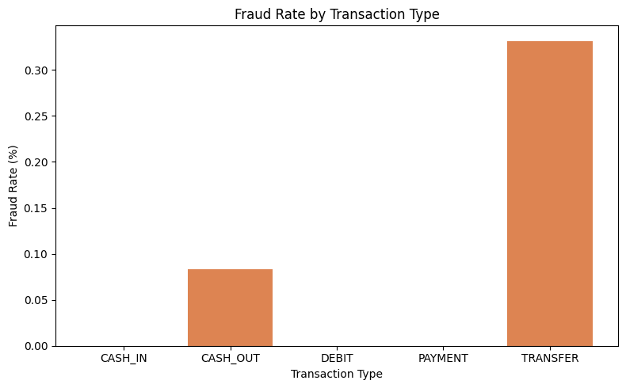

# Machine Learning Model Detects Fraudulent Mobile Transactions

## Hook

Tens of thousands of fraudulent mobile transactions occur every day, compromising the safety of customers and the integrity of financial institutions.

## Problem Statement

Mobile payment platforms, such as Venmo and Zelle, process millions of transactions daily, and identifying fraudulent transactions manually is an impossible task. Fraudulent transactions can follow similar patterns, such as unusually large transaction amounts or common transaction types. We attempt to identify these patterns and create a model to classify transactions as fraudulent or not fraudulent based on transaction type, amount, whether the recipient is the merchant or customer, the hour of the day, and the day of the month.

## Solution Description

To solve this problem, we built a machine learning model to classify transactions as fraudulent (1) or non-fraudulent (0). To do so, the model analyzes each transaction's type, amount, type of recipient, time of day, and day of the month. The model estimates the probability of a transaction being fraudulent, and if that probability is over a defined threshold, it is flagged as fraudulent and sent for manual review. As shown in the chart below, fraudulent transaction rates vary by transaction type, with "Transfer" showing the highest fraud rate at roughly 0.33%. This helps the model classify mobile payment fraud.

## Chart
