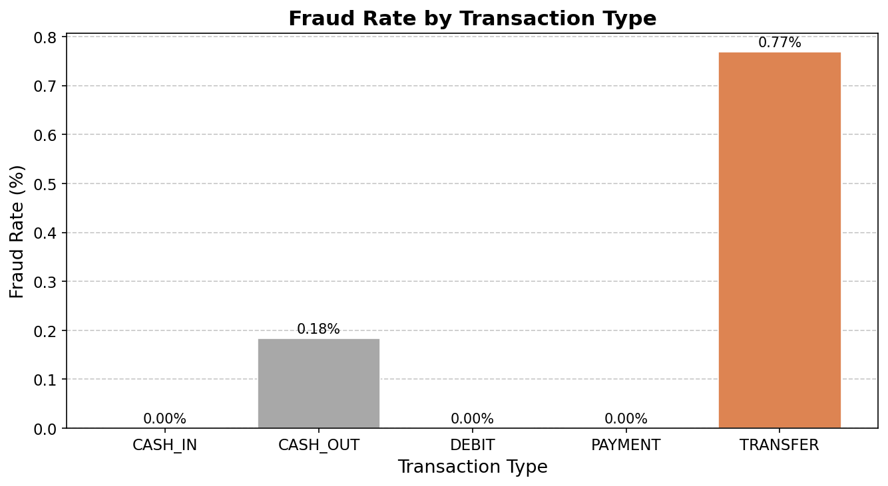

# Machine Learning Model Detects Fraudulent Mobile Transactions

## Hook

Tens of thousands of fraudulent mobile transactions occur every day, compromising the safety of customers and the integrity of financial institutions.

## Problem Statement

Mobile payment platforms, such as Venmo and Zelle, process millions of transactions daily. These transactions consist of sending money to friends, shopping online, paying bills, and much more. Fraudsters are also using these platforms, stealing money from users, and by the time people realize it, the money is gone. Bank account transfers and cash-outs are the most common attack methods, and financial institutions currently struggle to catch them before the damage is done to users.

## Solution Description

To solve this problem, we developed a system that automatically flags suspicious transactions before they are processed, allowing banks and payment platforms enough time to manually review them. When the system reviews a transaction, it examines its size, type, identity of the customer and merchant, and the time of day and month. It learns trends in fraudulent activity, and detects unusual, unique transaction activity so that humans can take a closer look. As shown in the chart below, certain transaction types like transfers carry a much higher fraud rate than others, making them a key signal for catching fraud early. With this kind of early warning system in place, financial institutions can protect their customers before money changes hands rather than after.

## Chart

*Figure 1: Fraud rate by transaction type in the PaySim dataset. Transfer transactions show the highest fraud rate at approximately 0.77%, making transaction type a key predictor for fraud detection.*